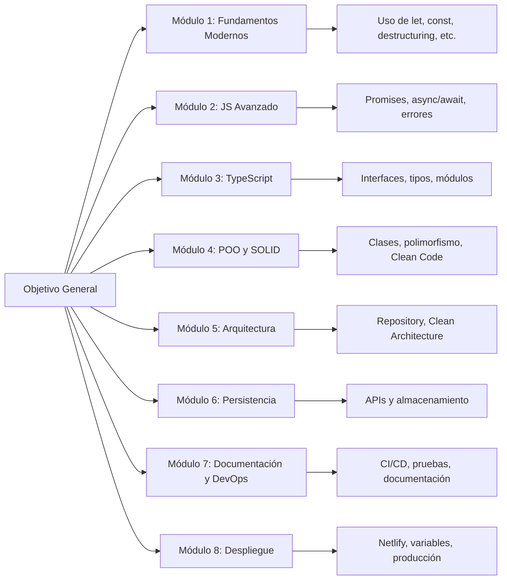

# Objetivos generales y específicos

## Objetivo General del Curso

Desarrollar en los estudiantes la capacidad de **diseñar, construir** y **documentar aplicaciones empresariales modernas** utilizando **JavaScript** y **TypeScript** con enfoque en **buenas prácticas** de codificación, **principios SOLID, Clean Code** y **Clean Architecture**.

## Objetivos Específicos por Módulo

1. Módulo 1: Introducción y Fundamentos Modernos
   - Comprender la evolución del lenguaje JavaScript y su integración con TypeScript.
   - Utilizar estructuras modernas del lenguaje que mejoran la legibilidad y mantenibilidad del código.
   - Configurar un entorno de desarrollo profesional con herramientas del ecosistema actual.
2. Módulo 2: JavaScript Avanzado
   - Aplicar asincronía usando técnicas modernas como async/await.
   - Comprender los fundamentos del scope, closures y funciones de orden superior.
   - Gestionar errores y cancelaciones de peticiones de forma controlada.
3. Módulo 3: Fundamentos de TypeScript
   - Comprender y aplicar tipos estáticos y dinámicos de forma segura.
   - Diferenciar entre anotaciones de tipos, inferencia y uso de type e interface.
   - Modularizar código para favorecer la escalabilidad de proyectos.
4. Módulo 4: POO, Buenas Prácticas y Principios
   - Implementar Programación Orientada a Objetos (POO) en TypeScript de manera coherente con Clean Code y SOLID.
   - Reconocer cuándo usar herencia, composición, abstracción e interfaces.
   - Evaluar y refactorizar código según principios de diseño profesional.
5. Módulo 5: Diseño y Arquitectura Empresarial
   - Comprender e implementar patrones de diseño (Factory, Singleton, Repository).
   - Aplicar los principios de Clean Architecture en aplicaciones frontend y backend.
   - Diseñar sistemas desacoplados con separación clara de responsabilidades.
6. Módulo 6: Persistencia y APIs
   - Dominar el uso de Fetch, Axios, localStorage, sessionStorage e IndexedDB.
   - Comprender el diseño y consumo de APIs RESTful con seguridad básica.
   - Gestionar tokens y autenticación en aplicaciones empresariales.
7. Módulo 7: Documentación y DevOps
   - Generar documentación técnica efectiva usando herramientas como TypeDoc y Swagger.
   - Integrar procesos de calidad como linters, formatters, pruebas y CI/CD con GitHub Actions.
8. Módulo 8: Despliegue y Presentación
   - Preparar builds listos para producción.
   - Publicar proyectos en plataformas modernas como GitHub Pages, Netlify y Vercel.
   - Garantizar buenas prácticas de seguridad en entornos de despliegue.

## Cascada de Objetivos

## Aplicaciones prácticas reales

- **Proyectos empresariales:** El curso está pensado para replicar condiciones del desarrollo real de software (CI/CD, testing, documentación, etc.).
- **Portafolio profesional:** Cada módulo contribuye a un entregable reutilizable en entrevistas técnicas o propuestas freelance.
- **Proyectos open-source:** La arquitectura y documentación enseñadas son estándar en la comunidad open-source profesional.
