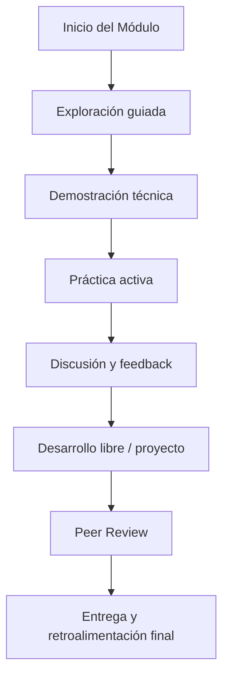

# Metodología y dinámica del curso

La metodología adoptada en esta electiva está diseñada para **simular un entorno de desarrollo real**, integrando principios ágiles, pensamiento crítico y habilidades técnicas prácticas. Se promueve un **aprendizaje activo, colaborativo y progresivo**, basado en proyectos, resolución de problemas y aplicación directa del conocimiento.

## Modelo de Aprendizaje Activo: "Aprender Haciendo"

El curso se basa en una estrategia de enseñanza centrada en el estudiante:

- **Proyectos por módulos**, que simulan aplicaciones reales.
- **Mini retos técnicos** semanales (desafíos cortos).
- **Katas de código**, para mejorar fluidez y calidad técnica.
- **Revisión entre pares** (peer review) en ejercicios clave.
- **Presentaciones técnicas** al final de cada módulo.

> Cada módulo es una pieza que construye un sistema empresarial completo.

## Flujo metodológico

