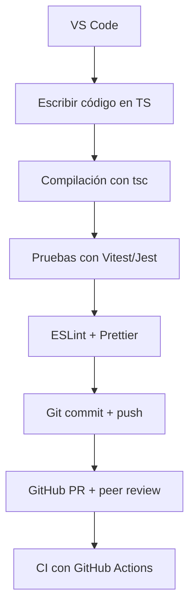

# Herramientas y entorno de desarrollo sugerido

Seleccionar un entorno de desarrollo adecuado no solo agiliza la codificación, sino que también **fomenta la colaboración**, el **control de calidad**, la **automatización** y la **escalabilidad del proyecto**. Para esta electiva avanzada de **JavaScript y TypeScript**, orientada al desarrollo empresarial, se utilizarán herramientas ampliamente adoptadas en la industria.

## Entorno base

|Componente|Descripción|
|--|--|
|**Editor de código**|[Visual Studio Code (VS Code)](https://code.visualstudio.com/) – ligero, extensible y ampliamente adoptado.|
|**Node.js**|Entorno de ejecución para JS y gestor de paquetes `npm`.|
|**TypeScript**|Superset tipado de JavaScript, obligatorio en todos los proyectos.|
|**Git y GitHub**|Control de versiones y gestión colaborativa de proyectos.|
|**Terminal (bash/zsh/pwsh)**|Interacción directa con CLI para instalar, ejecutar y automatizar tareas.|

## Plugins de VS Code recomendados

- ESLint → Validación de estilo de código.
- Prettier → Formateo automático del código.
- GitLens → Visualización avanzada del historial Git.
- Live Server → Servidor local para proyectos frontend simples.
- TypeScript Importer → Gestión de imports en TS.
- REST Client → Pruebas de endpoints directamente desde VS Code.

## Librerías y dependencias esenciales

|Categoría|Herramienta|Uso principal|
|--|--|--|
|Linter / Formateo|ESLint, Prettier|Limpieza y consistencia del código|
|Testing|Jest / Vitest|Pruebas unitarias y de integración|
|Documentación|TypeDoc / Swagger|Documentación de código y APIs|
|Framework backend|Express / NestJS|Desarrollo backend estructurado|
|HTTP client|Axios / Fetch|Peticiones HTTP avanzadas|
|Persistencia local|localStorage / IndexedDB|Manejo de datos en navegador|
|DevOps|Husky / Lint-staged|Pre-commits, validación de código|

## Flujo de desarrollo



## Automatización de calidad de código

- **ESLint + Prettier:** Validación automática del estilo en cada guardado o commit.
- **Husky + lint-staged:** Ganchos pre-commit que bloquean código malformado antes de subirlo.
- **Vitest/Jest:** Pruebas integradas con cobertura y compatibilidad con TypeScript.

## Scripts recomendados en `package.json`

```json
{
  "scripts": {
    "start": "ts-node src/main.ts",
    "build": "tsc",
    "lint": "eslint . --ext .ts",
    "format": "prettier --write .",
    "test": "vitest run",
    "prepare": "husky install"
  }
}
```

## Clean Architecture aplicado

```txt
project-root/
│
├── src/
│   ├── domain/
│   ├── application/
│   ├── infrastructure/
│   ├── interfaces/
│   └── main.ts
│
├── tests/
├── .eslintrc.js
├── .prettierrc
├── tsconfig.json
├── package.json
└── README.md
```

## Configuración base de `tsconfig.json`

```json
{
  "compilerOptions": {
    "target": "ES2020",
    "module": "CommonJS",
    "strict": true,
    "esModuleInterop": true,
    "skipLibCheck": true,
    "outDir": "./dist"
  },
  "include": ["src/**/*"]
}
```

## Casos de uso reales

- **NestJS:** framework empresarial basado en Express, usado por empresas como Adidas, Roche y Capgemini.
- **CI/CD con GitHub Actions:** usado por proyectos como Angular, Vue y Deno para automatizar validaciones.
- **Prettier + ESLint:** adoptado en empresas como Meta y Microsoft para mantener consistencia entre cientos de desarrolladores.
- **TypeDoc + Swagger:** utilizados por APIs públicas como Stripe, GitHub y Slack.

## Referencias

- Martin, R. C. (2017). Clean Architecture: A Craftsman's Guide to Software Structure and Design. Prentice Hall.
- [JavaScript Style Guide.](https://google.github.io/styleguide/jsguide.html)
- [NestJS Documentation](https://docs.nestjs.com/)
- [GitHub Actions Documentation.](https://docs.github.com/actions)
- [ESLint.](https://eslint.org/)
- [Prettier](https://prettier.io/)
- [TypeScript](https://www.typescriptlang.org/)
- [Husky](https://typicode.github.io/husky)
- [Vitest](https://vitest.dev/)
