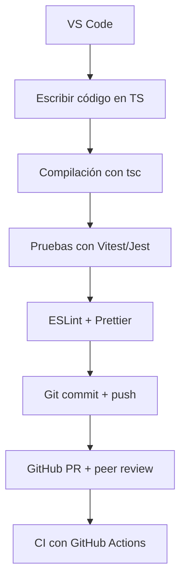

# Herramientas y entorno de desarrollo sugerido

Seleccionar un entorno de desarrollo adecuado no solo agiliza la codificación, sino que también **fomenta la colaboración**, el **control de calidad**, la **automatización** y la **escalabilidad del proyecto**. Para esta electiva avanzada de **JavaScript y TypeScript**, orientada al desarrollo empresarial, se utilizarán herramientas ampliamente adoptadas en la industria.

## Entorno base

|Componente|Descripción|
|--|--|
|**Editor de código**|[Visual Studio Code (VS Code)](https://code.visualstudio.com/) – ligero, extensible y ampliamente adoptado.|
|**Node.js**|Entorno de ejecución para JS y gestor de paquetes `npm`.|
|**TypeScript**|Superset tipado de JavaScript, obligatorio en todos los proyectos.|
|**Git y GitHub**|Control de versiones y gestión colaborativa de proyectos.|
|**Terminal (bash/zsh/pwsh)**|Interacción directa con CLI para instalar, ejecutar y automatizar tareas.|

## Plugins de VS Code recomendados

- ESLint → Validación de estilo de código.
- Prettier → Formateo automático del código.
- GitLens → Visualización avanzada del historial Git.
- Live Server → Servidor local para proyectos frontend simples.
- TypeScript Importer → Gestión de imports en TS.
- REST Client → Pruebas de endpoints directamente desde VS Code.

## Librerías y dependencias esenciales

|Categoría|Herramienta|Uso principal|
|--|--|--|
|Linter / Formateo|ESLint, Prettier|Limpieza y consistencia del código|
|Testing|Jest / Vitest|Pruebas unitarias y de integración|
|Documentación|TypeDoc / Swagger|Documentación de código y APIs|
|Framework backend|Express / NestJS|Desarrollo backend estructurado|
|HTTP client|Axios / Fetch|Peticiones HTTP avanzadas|
|Persistencia local|localStorage / IndexedDB|Manejo de datos en navegador|
|DevOps|Husky / Lint-staged|Pre-commits, validación de código|

## Flujo de desarrollo



## Automatización de calidad de código

- **ESLint + Prettier:** Validación automática del estilo en cada guardado o commit.
- **Husky + lint-staged:** Ganchos pre-commit que bloquean código malformado antes de subirlo.
- **Vitest/Jest:** Pruebas integradas con cobertura y compatibilidad con TypeScript.

## Creación de proyectos JS y TS desde cero

### Proyecto JavaScript puro (Node.js)

Para crear un proyecto de JS puro debes partir con el archivo `package.json`, el cual puedes crearlo al ejecutar el siguiente comando:

```bash
npm init -y
```

La bandera `-y` nos permite omitir el ingresar datos que serán almacenados en `package.json`.

También es aconsejable instalar las siguientes herramientas básicas:

```bash
npm install eslint prettier --save-dev
npx eslint --init
```

### Proyecto TypeScript puro

Para un proyecto de TS puro, puedes seguir los anteriores pasos, pero debes inicializar TS con los siguientes comandos:

```bash
npm install typescript --save-dev
npx tsc --init
```

:::info

Al momento de instalar una dependencia puedes abreviar pasos, por ejemplo: el comando `install` lo puedes reemplazar por `i`, la bandera `--save-dev` la puedes reemplazar por `-D`, y aunque viene por defecto desde la versión 5 de npm y no es necesario declararla, `--save` la puedes abreviar por `-S`. Con este presente nuestro comando anterior puede quedar como  `npm i typescript -D`

:::

Otro paso importante es instalar ts-node para ejecutar el código typescript

```bash
pnpm i -D ts-node
```

Pero, lo puedes omitir transpilando el código a JS con el comando `npx tsc`, habiendo configurado la propiedad `outDir` en `tsconfig.json`

## Scripts recomendados en `package.json`

```json
{
  "scripts": {
    "start": "ts-node src/main.ts",
    "build": "tsc",
    "lint": "eslint . --ext .ts",
    "format": "prettier --write .",
    "test": "vitest run",
    "prepare": "husky install"
  }
}
```

## Crear proyecto con Vite

Vite es ideal para frontend (JS/TS), pero también útil para APIs mock o demos empresariales.

Para crear un proyecto con una plantilla de Vite debes ejecutar:

```bash
npm create vite@latest
```

En este paso seleccionas la plantilla de tu elección, en este caso, seleccionamos la plantilla de Vanilla + TS, y seguimos los pasos en consola.

## Clean Architecture aplicado

```txt
project-root/
│
├── src/
│   ├── domain/
│   ├── application/
│   ├── infrastructure/
│   ├── interfaces/
│   └── main.ts
│
├── tests/
├── .eslintrc.js
├── .prettierrc
├── tsconfig.json
├── package.json
└── README.md
```

## Configuración base de `tsconfig.json`

```json json title="tsconfig.json" showLineNumbers
{
  "compilerOptions": {
    "target": "ES2020",
    "module": "CommonJS",
    "strict": true,
    "esModuleInterop": true,
    "skipLibCheck": true,
    "outDir": "./dist"
  },
  "include": ["src/**/*"]
}
```

## Configurar rutas absolutas

Este paso es importante para evitar imports largos y poco mantenibles.

1. Edita el archivo `tsconfig.json`

   ```json title="tsconfig.json" showLineNumbers
   {
     "compilerOptions": {
       "baseUrl": "./src",
       "paths": {
         "@domain/*": ["domain/*"],
         "@app/*": ["application/*"],
         "@infra/*": ["infrastructure/*"]
       }
     }
   }
   ```

2. En el archivo `main.ts` (o cualquier archivo que importe módulos), importa:

```ts
import { User } from '@domain/entities/User';
import { CreateUserUseCase } from '@app/usecases/CreateUser';
```

Si estás usando Vite, debes configurar el archivo `vite.config.ts` para que reconozca los paths (esto también aplica para JS):

1. Instala la siguiente dependencia:

   ```bash
   npm install -D @rollup/plugin-alias
   ```

2. Edita `vite.config.ts`:

   ```ts title="vite.config.ts" showLineNumbers
   import { defineConfig } from 'vite';
   import path from 'path';

   export default defineConfig({
     resolve: {
       alias: {
         '@domain': path.resolve(__dirname, './src/domain'),
         '@app': path.resolve(__dirname, './src/application'),
         '@infra': path.resolve(__dirname, './src/infrastructure'),
       },
     },
   });
   ```

3. Es importante que valides que estás usando `baseUrl` en `tsconfig.json` y `alias` en `vite.config.ts` al mismo tiempo.

## Casos de uso reales

- **NestJS:** framework empresarial basado en Express, usado por empresas como Adidas, Roche y Capgemini.
- **CI/CD con GitHub Actions:** usado por proyectos como Angular, Vue y Deno para automatizar validaciones.
- **Prettier + ESLint:** adoptado en empresas como Meta y Microsoft para mantener consistencia entre cientos de desarrolladores.
- **TypeDoc + Swagger:** utilizados por APIs públicas como Stripe, GitHub y Slack.

## Referencias

- Martin, R. C. (2017). Clean Architecture: A Craftsman's Guide to Software Structure and Design. Prentice Hall.
- [JavaScript Style Guide.](https://google.github.io/styleguide/jsguide.html)
- [NestJS Documentation](https://docs.nestjs.com/)
- [GitHub Actions Documentation.](https://docs.github.com/actions)
- [ESLint.](https://eslint.org/)
- [Prettier](https://prettier.io/)
- [TypeScript](https://www.typescriptlang.org/)
- [Husky](https://typicode.github.io/husky)
- [Vitest](https://vitest.dev/)
