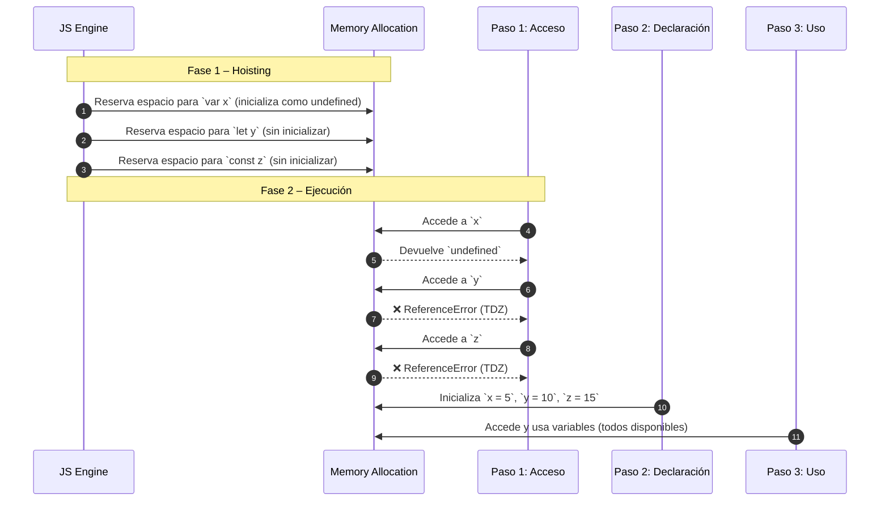

# let, const, y diferencias con var

En JavaScript, existen tres formas principales de declarar variables: `var`, `let` y `const`. Aunque `var` fue la única forma original, **ES6 (2015)** introdujo `let` y `const` para solventar varias deficiencias y mejorar la robustez del lenguaje. Entender sus diferencias es crucial para **evitar errores silenciosos**, mejorar la legibilidad y **mantener código seguro y predecible**.

## Diferencias entre var, let y const

|Característica|`var`|`let`|`const`|
|--|--|--|--|
|Ámbito (scope)|Función|Bloque|Bloque|
|Reasignación|✅|✅|❌|
|Redeclaración|✅|❌|❌|
|Hoisting|✅ (inicializa como `undefined`)|✅ (sin inicializar)|✅ (sin inicializar)|
|Temporal Dead Zone (TDZ)|❌|✅|✅|
|Uso recomendado|❌ Evitar|✅ Variables mutables|✅ Variables inmutables|

## Ejemplo en código

```js title="src/interfaces/VariableScopeDemo.js" showLineNumbers
/**
 * Demonstrates the differences between var, let and const.
 */
export function demonstrateVariableScopes() {
  if (true) {
    var functionScoped = "I'm accessible outside this block";
    let blockScoped = "I'm limited to this block";
    const immutable = "I'm also block-scoped and immutable";

    console.log(blockScoped);       // ✅ OK
    console.log(immutable);         // ✅ OK
  }

  console.log(functionScoped);      // ✅ OK (var is function-scoped)
  // console.log(blockScoped);      // ❌ Error
  // console.log(immutable);        // ❌ Error
}
```

- Usa `const` por defecto.
- Usa `let` solo si necesitas reasignar el valor.
- Evita `var` completamente.

## Comportamiento de alcance

```js showLineNumbers
console.log(x);    // ✅ undefined
// console.log(y); // ❌ ReferenceError
// console.log(z); // ❌ ReferenceError

var x = 5;
let y = 10;
const z = 15;

console.log(x, y, z); // ✅ 5 10 15
```



1. Fase de compilación (Hoisting):
   - `var x`: **se eleva** y se inicializa automáticamente con `undefined`.
   - `let y` y `const z`: **se elevan**, pero **no se inicializan**, quedando en la **Zona Temporal Muerta (TDZ)**.
2. Fase de ejecución:
   - Al acceder a `x` antes de su declaración, retorna `undefined` sin error.
   - Al acceder a `y` o `z` antes de su inicialización, se lanza un `ReferenceError`.}
   - Una vez declaradas, todas pueden usarse normalmente (salvo que `const` no puede reasignarse).

## Hoisting y Temporal Dead Zone (TDZ)

El **hoisting** es un comportamiento donde las declaraciones de variables y funciones **son movidas (o "elevadas") al inicio de su ámbito (scope)** antes de la ejecución del código. La **Temporal Dead Zone (TDZ)** es el período dentro del alcance de una variable donde **no se puede acceder a ella**, generalmente justo antes de su declaración e inicialización.

```js title="src/interfaces/VariableScopeDemo.js" showLineNumbers
function testHoisting() {
  console.log(x);      // undefined (hoisting con var)
  var x = 5;

  // console.log(y);   // ❌ ReferenceError (TDZ con let)
  let y = 10;

  // console.log(z);   // ❌ ReferenceError (TDZ con const)
  const z = 15;
}

testHoisting()
```

## Casos donde se refleja esta diferencia

Bug real por uso incorrecto de `var`:

```js showLineNumbers
for (var i = 0; i < 3; i++) {
  setTimeout(() => console.log(i), 100);
}
// Output: 3, 3, 3
```

Solución con `let`:

```js showLineNumbers
for (let i = 0; i < 3; i++) {
  setTimeout(() => console.log(i), 100);
}
// Output: 0, 1, 2
```

## Buenas prácticas recomendadas

|Principio|Aplicación|
|--|--|
|**Clean Code**|Se favorece la **inmutabilidad** (`const`) y nombres con significado. Evita errores silenciosos con `var`.|
|**SOLID**|Favorece el principio de responsabilidad única: las variables solo contienen lo necesario y no cambian su propósito.|
|**Clean Architecture**|Al limitar el ámbito, se favorece el encapsulamiento dentro de cada módulo o capa de la aplicación.|

## Referencias

- Flanagan, D. (2020). JavaScript: The Definitive Guide (7th ed.). O'Reilly Media.
- Crockford, D. (2008). JavaScript: The Good Parts. O’Reilly Media.
- Mozilla Developer Network. (s.f.). [let, const, var](https://developer.mozilla.org/es/docs/Web/JavaScript/Reference/Statements/let)
- [TypeScript Handbook](https://www.typescriptlang.org/docs/)
- [JavaScript Style Guide](https://google.github.io/styleguide/jsguide.html)
