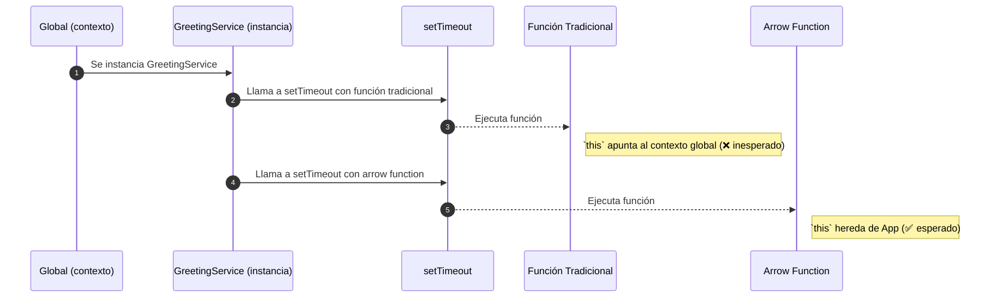

# Arrow functions y contexto del this

Las **arrow functions** (`() => ()`) son una forma concisa de declarar funciones introducida en **ES6**. Su uso es común en programación funcional, callbacks, promesas y más. Pero lo más relevante no es solo su sintaxis, sino **cómo manejan el contexto de `this`.**

:::info

Las arrow functions **no redefinen el valor de `this`**. Heredan el contexto del lugar donde fueron definidas (lexical `this`).

:::

## Arrow Functions vs Funciones Tradicionales

|Característica|Función tradicional|Arrow Function|
|--|--|--|
|Sintaxis larga|✅|❌|
|Tiene su propio `this`|✅|❌ (hereda contexto)|
|Se puede usar como constructor (`new`)|✅|❌|
|Tiene `arguments`|✅|❌ (usa rest `...`, ejm: `const sum = (...args: number[]) => args.reduce((a, b) => a + b);`)|
|Ideal para métodos|✅|❌|
|Ideal para callbacks|Regular|✅ Excelente|

## ¿Por qué las arrow functions no son ideales para métodos?

Cuando defines un **método dentro de una clase o prototipo**, lo normal es querer que ese método tenga acceso al contexto de la instancia (es decir, `this` apuntando al objeto creado). Si defines ese método como una **arrow function en la clase**, ese comportamiento puede volverse inmutable e inesperado.

Expliquemos esto con un ejemplo:

```js showLineNumbers
class Greeter {
  name = 'World';

  // highlight-next-line
  greet = () => {
    console.log(`Hello, ${this.name}`);
  };
}
```

Este código **funcionará**, pero tiene una implicación importante:

:::warning

El `this` de `greet` queda **ligado de forma permanente al momento de creación** del objeto, y **no puede cambiarse** con `.call()`, `.bind()`, ni ser reasignado dinámicamente.

:::

En cambio, las funciones tradicionales permiten control dinámico de `this`:

```js showLineNumbers
class Greeter {
  name = 'World';

  // highlight-next-line
  greet() {
    console.log(`Hello, ${this.name}`);
  }
}
```

Este método tradicional:

- Puede ser **reutilizado** o **heredado**.
- Puede usarse con `super.greet()`.
- Se comporta mejor con herramientas como `bind`, `call`, `apply`.

En resumen:

:::info

Usar arrow functions para métodos **limita su reutilización**, especialmente en patrones como herencia, polimorfismo o mezcla de contextos.

:::

## Cuando usar arrow functions

- Callbacks (`map`, `filter`, `forEach`, `then`)
- Métodos dentro de funciones si se quiere fijar `this`
- Métodos anónimos que no usan `this`
- Componentes funcionales en React

## Código de ejemplo

```js title="src/domain/GreetingService.ts" showLineNumbers
/**
 * Demonstrates the difference in `this` binding between
 * traditional functions and arrow functions.
 */
export class GreetingService {
  private name = 'TypeScript Developer';

  public traditionalFunction() {
    setTimeout(function () {
      // highlight-next-line
      // ❌ `this` is undefined or refers to global
      console.log(`Hello from traditional: ${this?.name}`);
    }, 1000);
  }

  public arrowFunction() {
      setTimeout(() => {
      // highlight-next-line
      // ✅ `this` refers to GreetingService
      console.log(`Hello from arrow: ${this.name}`);
    }, 1000);
  }
}
```

## ¿Qué es el contexto this?

- `this` hace referencia al objeto que invoca una función.
- En funciones tradicionales, `this` puede variar según el **modo de invocación** (`objeto.método`, `call`, `bind`, etc.).
- En arrow functions, `this` se toma del **entorno léxico donde fue definida**, no del lugar donde se invoca.

## Diagrama de secuencia - this en funciones



1. **Paso 1: Creación del contexto:**

   El entorno global (navegador o Node.js) crea una instancia de la clase `GreetingService`.

   ```js showLineNumbers
   const service = new GreetingService();
   ```

   Aquí, `this` dentro de `GreetingService` hace referencia correctamente a la instancia creada.

2. **Paso 2: Uso de función tradicional en setTimeout:**

   ```js showLineNumbers
   setTimeout(function () {
     console.log(this.name); // ❌
   }, 1000);
   ```

   - En este caso, `this` **no hace referencia al objeto** `GreetingService`, sino al **contexto global** (en el navegador, es `window`; en Node.js, puede ser `undefined` en modo estricto).
   - Este error es muy común y puede romper el acceso a métodos o propiedades de la clase.

3. **Paso 3: Uso de arrow function en setTimeout:**

   ```js showLineNumbers
   setTimeout(() => {
     console.log(this.name); // ✅
   }, 1000);
   ```

   - Aquí, `this` **no es redefinido** por la arrow function.
   - En cambio, **hereda el valor de `this` léxico**, que es el que estaba en el entorno donde fue definida: la instancia de `GreetingService`.
   - Esto permite acceder correctamente a propiedades y métodos de la clase.

En resumen:

|Contexto|Función Tradicional|Arrow Function|
|--|--|--|
|`this` en `setTimeout`|Apunta al contexto global (`window`, `undefined`, etc.)|Hereda de donde fue definida (instancia de clase)|
|Acceso a `this.name`|❌ Error o `undefined`|✅ Funciona correctamente|

## Casos reales y uso profesional

- **Callbacks en eventos DOM** o **React hooks**: las arrow functions evitan errores comunes con el contexto.
- **Funciones en controladores NestJS**: el uso correcto de `this` es crucial para acceder a servicios y dependencias.
- **Clases en TypeScript**: al usar arrow functions como métodos, se evita tener que hacer `bind(this)` manual.

## Aplicación de buenas prácticas

|Principio|Aplicación|
|--|--|
|**Clean Code**|Arrow functions reducen ruido visual y errores por `this`.|
|**SOLID**|Usar `this` correctamente evita violaciones al principio de responsabilidad única (SRP).|
|**Clean Architecture**|Mantener el comportamiento de métodos predecible y sin acoplamientos ocultos gracias al contexto léxico.|

## Referencias

- Flanagan, D. (2020). JavaScript: The Definitive Guide (7th ed.). O'Reilly Media.
- Mozilla Developer Network. (s.f.). [Arrow functions.](https://developer.mozilla.org/en-US/docs/Web/JavaScript/Reference/Functions/Arrow_functions)
- [TypeScript Handbook](https://www.typescriptlang.org/docs/)
- Crockford, D. (2008). JavaScript: The Good Parts. O’Reilly Media.
- [NestJS Docs](https://docs.nestjs.com)
- [JavaScript Style Guide](https://google.github.io/styleguide/jsguide.html)
