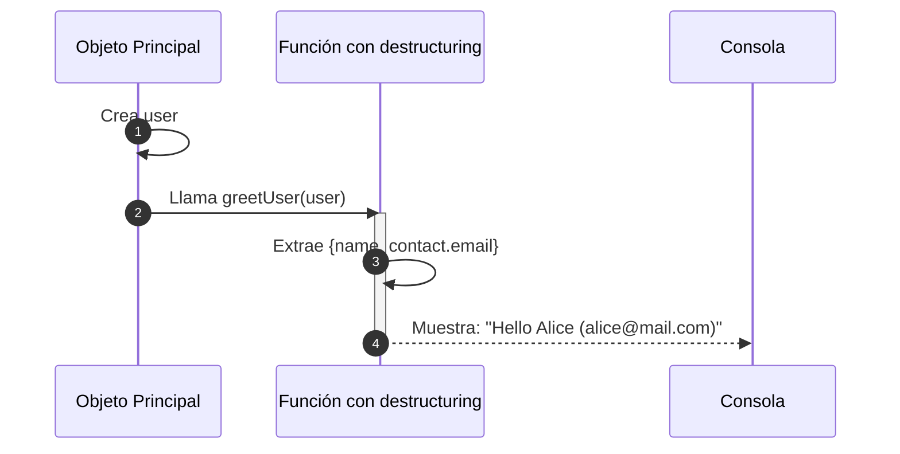

# Destructuring (arrays y objetos)

El destructuring (o desestructuración) es una **forma concisa de extraer valores** de **arreglos** o **propiedades de objetos** y asignarlos a variables. Introducido en ES6, permite evitar código repetitivo y mejora la claridad, especialmente en funciones, APIs y estructuras anidadas. Es uno de los pilares del JavaScript moderno, junto con arrow functions, spread/rest, y template literals.

## ¿Por qué usar destructuring?

- Reduce líneas de código innecesarias.
- Mejora la legibilidad de funciones.
- Permite aplicar default values, renombramiento de variables, y estructuras anidadas de forma elegante.

## Destructuring de objetos

```js showLineNumbers
const user = {
  id: 1,
  name: 'Alice',
  email: 'alice@example.com',
};

// Forma tradicional:
const name = user.name;

// Con destructuring:
const { name, email } = user;
```

Adicional, podemos aplicar destructuring con alias y valores por defecto

```js showLineNumbers
const { name: userName, phone = 'N/A' } = user;

console.log(userName); // 'Alice'
console.log(phone);    // 'N/A'
```

## Destructuring de arrays

```js showLineNumbers
const numbers = [10, 20, 30];

// Forma tradicional:
const first = numbers[0];

// Con destructuring:
const [a, b, c] = numbers;

console.log(a, b, c); // 10 20 30
```

Opcionalmente, podemos saltar posiciones y asignar valores por defecto:

```js showLineNumbers
const [x, , z = 99] = [1];
console.log(x); // 1
console.log(z); // 99
```

## Destructuring en funciones

Al usar destructuring en funciones se **mejora la claridad** de funciones que reciben objetos complejos.

```js showLineNumbers
function greet({ name }: { name: string }) {
  console.log(`Hello, ${name}`);
}

const user = { name: 'Bob', age: 25 };
greet(user); // Hello, Bob
```

## Destructuring anidado

```js showLineNumbers
const employee = {
  id: 101,
  personal: {
    name: 'Carol',
    contact: {
      email: 'carol@example.com',
    },
  },
};

const { personal: { contact: { email }, }, } = employee;

console.log(email); // 'carol@example.com'
```

## Aplicaciones reales

- **APIs REST:** Al obtener una respuesta JSON, puedes desestructurar directamente las propiedades necesarias.
- **Funciones en NestJS/Express:** Puedes desestructurar objetos como `req`, `res`, `body`, `query`, etc.
- **Testing:** Librerías como Jest permiten destructuring de objetos con mocks y resultados esperados.
- **React:** En `props`, el destructuring es una práctica común y limpia.

## Secuencia de destructuring en objectos anidados

Este ejemplo simula una llamada a función donde se pasa un objeto complejo, se realiza destructuring dentro de la función y se imprime el resultado.

```js showLineNumbers
function greetUser({ name, contact: { email } }) {
  console.log(`Hello ${name} (${email})`);
}

const user = {
  name: 'Alice',
  contact: {
    email: 'alice@mail.com',
  },
};

greetUser(user);
```



1. El objeto `user` es creado en `main`, con estructura anidada.
2. La función `greetUser` es llamada con `user` como argumento.
3. Dentro de `greetUser`, se realiza destructuring anidado:
   - `name` se extrae directamente.
   - `email` se extrae desde `contact.email`.
4. Se imprime en consola un saludo que combina ambos datos.

## Buenas prácticas aplicadas

|Principio|Aplicación|
|--|--|
|**Clean Code**|Código más expresivo y conciso, evita repeticiones.|
|**SRP (SOLID)**|Permite funciones más simples al extraer solo lo necesario.|
|**Clean Architecture**|Extraer únicamente datos relevantes favorece independencia entre capas.|

## Referencias

- Flanagan, D. (2020). JavaScript: The Definitive Guide (7th ed.). O'Reilly Media.
- Mozilla Developer Network (MDN). (s.f.). [Destructuring assignment](https://developer.mozilla.org/en-US/docs/Web/JavaScript/Reference/Operators/Destructuring_assignment)
- [TypeScript Handbook](https://www.typescriptlang.org/docs)
- [JavaScript Style Guide](https://google.github.io/styleguide/jsguide.html)
