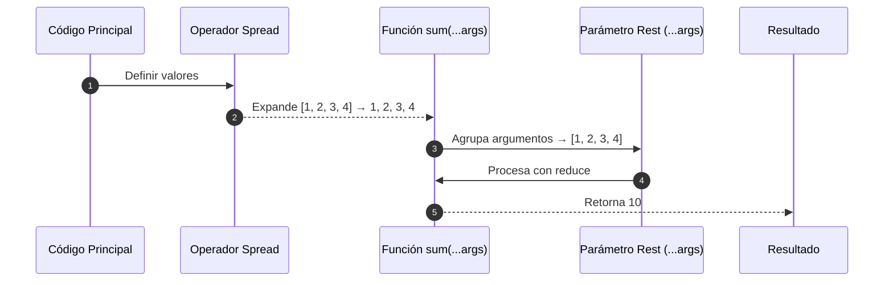

# Operador spread y rest

En JavaScript y TypeScript, el operador `...` se utiliza tanto para `expandir elementos` (**spread**) como para agrupar valores (**rest**). Su comportamiento depende del contexto:

- **Spread**: Expande una colección (array u objeto).
- **Rest**: Agrupa múltiples elementos en una colección.

La clave está en **dónde se usa**: en el **lado derecho** de una asignación es **spread**; en el **lado izquierdo** (como en parámetros o destructuring), es **rest**.

## Spread Operator - Expansión

En arreglos:

```js showLineNumbers
const arr1 = [1, 2];
const arr2 = [3, 4];
const combined = [...arr1, ...arr2]; // [1, 2, 3, 4]
```

En objetos:

```js showLineNumbers
const user = { name: 'Alice', email: 'alice@mail.com' };
const updated = { ...user, active: true }; 
// { name: 'Alice', email: 'alice@mail.com', active: true }
```

## Rest Operator - Agrupamiento

En parámetros de función:

```js showLineNumbers
function sum(...numbers: number[]) {
  return numbers.reduce((a, b) => a + b, 0);
}

sum(1, 2, 3, 4); // 10
```

En destructuring de arrays:

```js showLineNumbers
const [first, ...rest] = [10, 20, 30, 40];
console.log(first); // 10
console.log(rest);  // [20, 30, 40]
```

En destructuring de objetos:

```js showLineNumbers
const { name, ...others } = {
  name: 'Ana',
  age: 28,
  country: 'CO',
};

console.log(name);   // Ana
console.log(others); // { age: 28, country: 'CO' }
```

## Comparación rápida

|Uso|Nombre|Ejemplo clave|
|--|--|--|
|Expandir|Spread|`const all = [...a, ...b]`|
|Agrupar|Rest|`function(...args) {}`|
|En objetos|Ambos|`{...obj}` o `const {...rest} = obj`|

## Spread vs Rest en función

```js showLineNumbers
function sum(...args: number[]): number {
  return args.reduce((a, b) => a + b, 0);
}

const values = [1, 2, 3, 4];
const result = sum(...values); // ✅ Usa spread aquí
console.log(result); // 10
```



1. En el código principal se definen los valores del arreglo
2. Luego, se expande el arreglo dentro de los argumentos de la función `sum` usando el operador spread.
3. Dentro de la definición de la función `sum` se agrupan los argumentos en un arreglo usando el operador rest.
4. Se procesan los valores agrupados usando la función `reduce`.
5. Se retorna el valore de la operación.

## Buenas prácticas aplicadas

|Principio|Aplicación|
|--|--|
|**Clean Code**|Código más expresivo, menos mutaciones.|
|**SRP (SOLID)**|Funciones como `...args` mantienen su responsabilidad clara.|
|**Open-Closed**|Permite extender objetos sin modificarlos directamente.|

## Referencias

- Flanagan, D. (2020). JavaScript: The Definitive Guide (7th ed.). O'Reilly Media.
- Mozilla Developer Network (MDN). (s.f.). [Spread syntax (...)](https://developer.mozilla.org/en-US/docs/Web/JavaScript/Reference/Operators/Spread_syntax)
- [TypeScript Handbook](https://www.typescriptlang.org/docs)
- [JavaScript Style Guide.](https://google.github.io/styleguide/jsguide.html)
