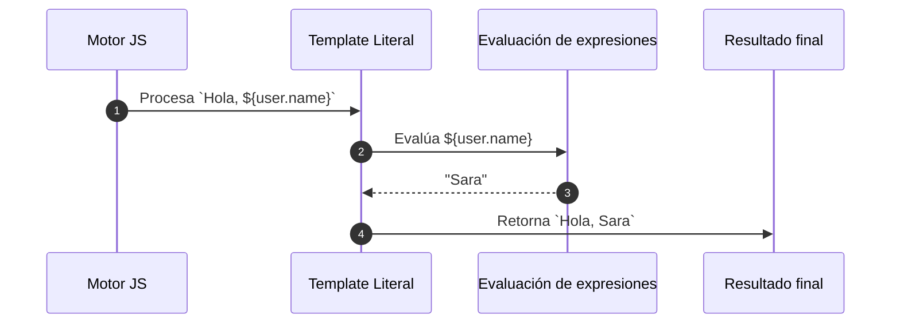

# Template literals

Los `template literals` son una forma moderna de crear cadenas de texto, introducida en ES6, que permite:

- Incrustar expresiones fácilmente (`${...}`)
- Crear cadenas **multilínea** sin caracteres especiales
- Concatenar texto y variables de manera clara y legible
- Generar estructuras dinámicas como HTML, JSON o SQL

Los template literals **reemplazan la concatenación con `+`**, haciendo el código más limpio y expresivo.

```js
const name = 'Sara';
const message = `Hola, ${name}!`;
console.log(message); // Hola, Sara!
```

## Características destacadas

|Característica|Ejemplo|
|--|--|
|Interpolación|`` `Total: $${price * quantity}` ``|
|Múltiples líneas|`` `Línea 1\nLínea 2` ``|
|Funciones etiquetadas|`` tag`Hola ${user}` `` (para sanitizar HTML, por ejemplo)|
|Inclusión de backticks|Usa backticks ` `` `|

## Ejemplos

1. Expresión interpolada

   ```js
   const a = 5;

   const b = 3;

   console.log(`La suma de ${a} y ${b} es ${a + b}`);
   // Output: La suma de 5 y 3 es 8
    ```

2. Cadena multilínea

   ```js
   const template = `
   Nombre: Sara
   Edad: 25
   Ciudad: Bogotá
   `;

   console.log(template);
   ```

3. Plantillas dinámicas (con HTML o JSON)

   ```js
   const user = { name: 'Luis', email: 'luis@mail.com' };

   const html = `
     <div class="user">
       <h2>${user.name}</h2>
       <p>Email: ${user.email}</p>
     </div>
   `;
   ```

4. Template Tags

   ```js
   function uppercase(strings: TemplateStringsArray, ...values: any[]) {
     return strings.reduce((acc, str, i) => acc + str + (values[i]?.toUpperCase?.() ||''), '');
   }

   const name = 'juan';
   console.log(uppercase`Hola, ${name}`); // Hola, JUAN
   ```

## Evaluación de Template Literal



## Buenas prácticas aplicadas

|Principio|Aplicación|
|--|--|
|**Clean Code**|Mejora la claridad y evita concatenación innecesaria.|
|**SRP (SOLID)**|Permite separar generación de contenido dinámico en funciones específicas.|
|**OCP (SOLID)**|Permite extender la lógica con funciones etiquetadas (tagged templates).|

## Referencias

- Flanagan, D. (2020). JavaScript: The Definitive Guide (7th ed.). O'Reilly Media.
- Mozilla Developer Network (MDN). (s.f.). [Template literals](https://developer.mozilla.org/en-US/docs/Web/JavaScript/Reference/Template_literals)
- [TypeScript Handbook](https://www.typescriptlang.org/docs)
- Crockford, D. (2008). JavaScript: The Good Parts. O’Reilly Media.
- [JavaScript Style Guide](https://google.github.io/styleguide/jsguide.html)
