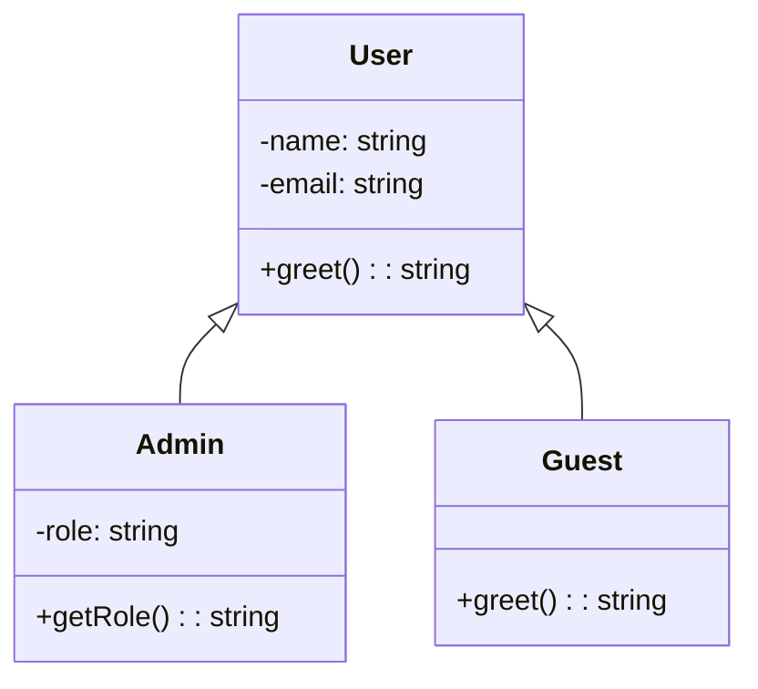

# Clases y herencia

La **Programación Orientada a Objetos** permite modelar software usando conceptos del mundo real: **clases**, **objetos**, **atributos**, **métodos** y **herencia**. Desde ES6, JavaScript soporta sintaxis de clases, que en TypeScript se **fortalece con tipado estático** y visibilidad.

Las clases encapsulan comportamiento y datos, y permiten **herencia**, **composición**, **abstracción** y **polimorfismo**, pilares del diseño robusto.

## Definición básica de clase (TS)

```ts title="src/domain/entities/User.ts" showLineNumbers
class User {
  // atributos
  private name: string;
  private email: string;

  constructor(name: string, email: string) {
    this.name = name;
    this.email = email;
  }

  // método
  public greet(): string {
    return `Hello, ${this.name}`;
  }
}

const user = new User('Sara', 'sara@mail.com');
console.log(user.greet()); // Hello, Sara
```

En este ejemplo vemos atributos encapsulados (`private`), constructor con inicialización, y métodos públicos bien definidos.

## Herencia y superclase

```ts title="src/domain/entities/Admin.ts" showLineNumbers
class Admin extends User {
  private role: string;

  constructor(name: string, email: string, role: string) {
    super(name, email); // llama al constructor de la superclase
    this.role = role;
  }

  public getRole(): string {
    return `${this.greet()} - Role: ${this.role}`;
  }
}
```

Este ejemplo usa `super()` para reutilizar la inicialización, y además se puede acceder a métodos heredados.

## Tipos de visibilidad en TypeScript

|Modificador|Acceso desde clase|Subclases|Externamente|
|--|--|--|--|
|`public`|✅|✅|✅|
|`private`|✅|❌|❌|
|`protected`|✅|✅|❌|

## Sobrescritura de métodos

```ts src="src/domain/entities/Guest.ts" showLineNumbers
class Guest extends User {
  public greet(): string {
    return `Welcome, guest: ${this.getName()}`;
  }

  protected getName(): string {
    // Simulación de acceso interno
    return 'Anonymous';
  }
}
```

En este caso se aplica el polimorfismo, un mismo método (`greet`) se comporta distinto según la subclase.

## Composición vs Herencia (breve mención)

- Herencia: "Es un" → `Admin` **es un** `User`
- Composición: "Tiene un" → `User` **tiene una** dirección

La composición será tratada más adelante, pero se menciona como buena práctica cuando la herencia se vuelve compleja.

## Diagrama de clases de Herencia



## Buenas prácticas

|Principio|Aplicación|
|--|--|
|**Clean Code**|Clases pequeñas, claras, con una única responsabilidad.|
|**SRP (SOLID)**|Cada clase representa una sola entidad del dominio.|
|**OCP (SOLID)**|Puedes extender una clase (`Admin`, `Guest`) sin modificar la original (`User`).|
|**LSP (SOLID)**|Las subclases pueden reemplazar a la superclase sin errores.|
|**Encapsulamiento (POO)**|Atributos privados, acceso controlado, separación de interfaz y comportamiento.|

## Referencias

- Martin, R. C. (2009). Clean Code: A Handbook of Agile Software Craftsmanship. Prentice Hall.
- Martin, R. C. (2017). Clean Architecture: A Craftsman's Guide to Software Structure and Design. Prentice Hall.
- Mozilla Developer Network. (s.f.). [Classes](https://developer.mozilla.org/en-US/docs/Web/JavaScript/Reference/Classes)
- TypeScript Handbook. (s.f.). [Classes](https://www.typescriptlang.org/docs/)
- Freeman, E., & Robson, E. (2014). Head First Design Patterns. O'Reilly Media.
