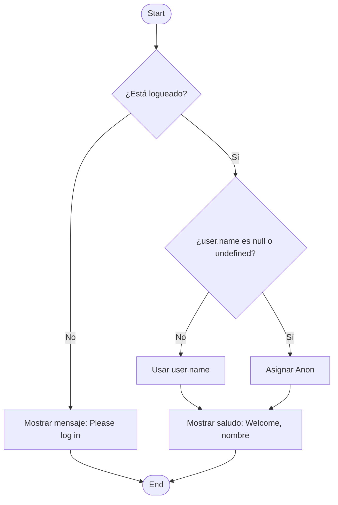

# Operador ternario y nullish coalescing

## ¿Qué es el operador ternario?

El **operador ternario** es una forma concisa de escribir una estructura `if/else` en una sola línea. Su sintaxis es:

```ts
condición ? valorSiVerdadero : valorSiFalso;
```

Se llama “ternario” porque involucra **tres** partes: una condición, un valor si se cumple, y otro si no.

Por ejemplo:

```ts showLineNumbers
const age = 20;
const status = age >= 18 ? 'Adult' : 'Minor';
console.log(status); // Adult
```

## ¿Qué es nullish coalescing (`??`)?

El operador `??` devuelve el **lado derecho si el lado izquierdo es `null` o `undefined`**, y **no** si es `false`, `0`, `""`, etc. Esto lo diferencia del `||`.

```ts
const value = input ?? 'Valor por defecto';
```

Útil cuando quieres asignar valores por defecto **solo si el valor es nulo o indefinido**, sin afectar falsy legítimos.

## Comparación: `||` vs `??`

Vamos a comparar con diferentes valores los resultados entre el operador Lógico OR (`||`) y el operador Nullish Coalescing. En ambos casos tenemos a la izquierda un valor x, y a la derecha un valor por defecto (`valor || 'default'` o `valor ?? 'default'`).

|Valor| Logical Or Operator | Nullish Coalescing |
|--|--|--|
|`null`|`'default'`|`'default'`|
|`undefined`|`'default'`|`'default'`|
|`false`|`'default'`|false|
|`0`|`'default'`|0|
|`""` (cadena vacía)|`'default'`|`""`|

## Ejemplo en TS

```ts showLineNumbers
function getUsername(user?: { name?: string }) {
  return user?.name ?? 'Guest';
}

console.log(getUsername({ name: '' }));       // ''
console.log(getUsername(undefined));          // 'Guest'
console.log(getUsername({ name: null }));     // 'Guest'
```

## Flujo condicional ternario y nullish

Miremos una combinación entre ternario y nullish coalescing:

```ts
const name = user?.name ?? 'Anon';
const greeting = isLoggedIn ? `Welcome, ${name}` : 'Please log in';
```



## Buenas prácticas aplicables

|Principio|Aplicación|
|--|--|
|**Clean Code**|Reemplaza `if/else` innecesarios por ternarios legibles.|
|**SRP (SOLID)**|Permite funciones que solo devuelven valores, sin lógica compleja anidada.|
|**OCP (SOLID)**|Permite extender la lógica sin alterar el control de flujo básico.|

## Referencias

- Flanagan, D. (2020). JavaScript: The Definitive Guide (7th ed.). O'Reilly Media.
- Mozilla Developer Network. (s.f.). [Conditional (ternary) operator.](https://developer.mozilla.org/en-US/docs/Web/JavaScript/Reference/Operators/Conditional_Operator)
- Mozilla Developer Network. (s.f.). [Nullish coalescing operator (??).](https://developer.mozilla.org/en-US/docs/Web/JavaScript/Reference/Operators/Nullish_coalescing_operator)
- [TypeScript Handbook.](https://www.typescriptlang.org/docs/)
