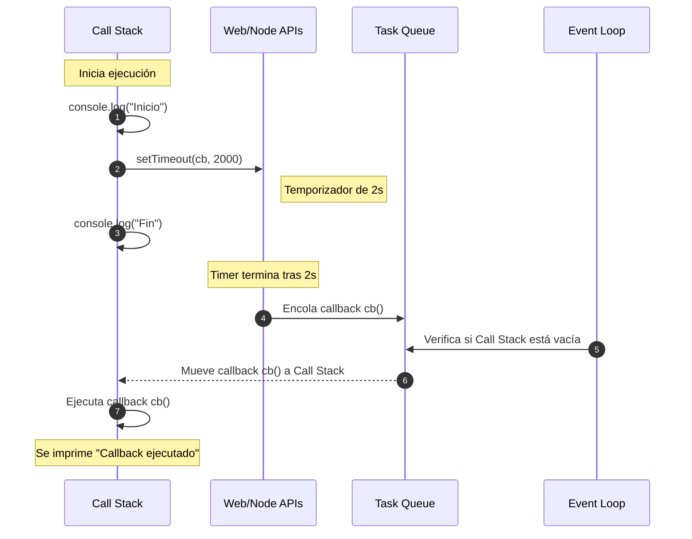

# Introducción a la asincronía en JS

JavaScript es un lenguaje **single-threaded** (usa un solo hilo de ejecución principal). Esto significa que **solo puede ejecutar una tarea a la vez**.
La **asincronía** permite que el programa **continúe ejecutando otras instrucciones** mientras espera que operaciones más lentas (por ejemplo, llamadas a APIs o lectura de archivos) finalicen.

:::success

La asincronía evita que la aplicación se “congele” mientras espera tareas externas.

:::

## Por qué es importante

- JavaScript se usa en entornos donde la **interfaz no puede bloquearse** (navegadores).
- Muchas operaciones son lentas: peticiones HTTP, acceso a bases de datos, timers, etc.
- Permite escribir aplicaciones **rápidas, fluidas y escalables**.

## Modelo de concurrencia: Event Loop

JavaScript utiliza un **event loop** (bucle de eventos) para manejar asincronía:

1. Ejecuta el código principal en la **call stack** (pila de ejecución).
2. Cuando encuentra tareas asincrónicas (por ejemplo `setTimeout` o `fetch`), las delega a APIs del navegador o de Node.js.
3. Cuando estas tareas terminan, sus callbacks se encolan en la **callback queue** (cola de tareas).
4. El event loop verifica si la pila está vacía y ejecuta lo que está en la cola.

## Ejemplo con setTimeout

```ts
console.log('1. Inicio');

setTimeout(() => {
  console.log('2. Callback asincrónico');
}, 2000);

console.log('3. Fin');
```

Salida:

```txt
1. Inicio
3. Fin
2. Callback asincrónico
```

La función `setTimeout` se ejecuta después de que el resto del código ha terminado, no bloquea el flujo principal.

## Representación visual


## Flujo asincrónico en JavaScript



## Tipos de operaciones asincrónicas comunes

- **Timers:** `setTimeout`, `setInterval`
- **Peticiones a APIs:** fetch, XMLHttpRequest, librerías como Axios
- **Operaciones en disco o base de datos:** en Node.js
- **Promesas y async/await**

## Casos reales

- Aplicaciones web que consumen APIs (e-commerce, redes sociales).
- Procesamiento de archivos grandes en Node.js sin bloquear a otros usuarios.
- Reproductores de video/audio que descargan en segundo plano.
- Notificaciones en tiempo real con WebSockets.

## Referencias

- Flanagan, D. (2020). JavaScript: The Definitive Guide (7th ed.). O’Reilly Media.
- Mozilla Developer Network. (s.f.). [Concurrency model and Event Loop](https://developer.mozilla.org/en-US/docs/Web/JavaScript/EventLoop).
- TypeScript Handbook. (s.f.). [Asynchronous Programming](https://www.typescriptlang.org/docs).
- Node.js Docs. (s.f.). [Timers](https://nodejs.org/api/timers.html).
- Gupta, I. (2024). [Promise Patterns vs Async/Await: A developer's Guide](https://levelup.gitconnected.com/promise-patterns-vs-async-await-a-developers-guide-dfba4fe4a520). Medium.
