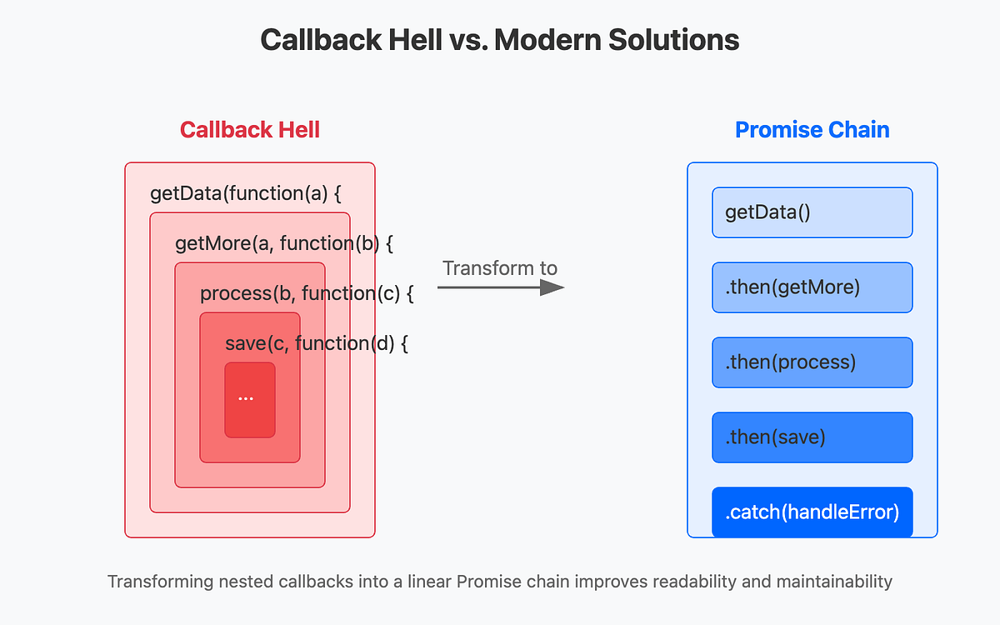
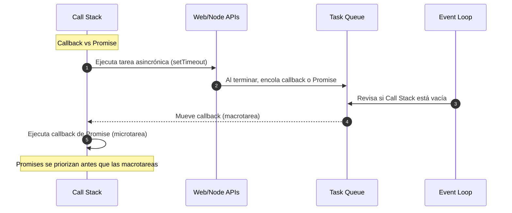

# Callbacks vs Promises

En JavaScript, cuando necesitamos manejar tareas asincrónicas (peticiones a APIs, timers, operaciones en disco, etc.), tenemos varias herramientas:

1. **Callbacks:** el mecanismo más antiguo y básico.
2. **Promises:** una evolución más robusta que permite escribir código más legible.

## ¿Qué es un Callback?

Un **callback** es una función que se pasa como argumento a otra función y se ejecuta cuando la tarea ha terminado.

```ts
function getData(callback: (data: string) => void) {
  setTimeout(() => {
    callback("Datos cargados");
  }, 2000);
}

getData((data) => {
  console.log(data); // "Datos cargados"
});
```

## Callback Hell

Cuando se encadenan muchos callbacks, el código se vuelve difícil de leer y mantener:

```ts
loginUser("user", (user) => {
  getUserOrders(user, (orders) => {
    getOrderDetails(orders[0], (details) => {
      console.log(details);
    });
  });
});
```

## ¿Qué es una Promise?

Una **Promise** es un objeto que representa un valor que estará disponible ahora, en el futuro o nunca. Puede estar en tres estados:

1. **Pending** (pendiente)
2. **Fulfilled** (resuelta correctamente)
3. **Rejected** (rechazada)

```ts
const promise = new Promise<string>((resolve, reject) => {
  setTimeout(() => {
    resolve("Datos cargados");
  }, 2000);
});

promise
   .then((data) => console.log(data))
   .catch((err) => console.error(err));
```

## Encadenamiento de Promesas (Promises Chaining)

Las Promises eliminan el **anidamiento profundo**, o el Callback Hell.

```ts
loginUser("user")
  .then((user) => getUserOrders(user))
  .then((orders) => getOrderDetails(orders[0]))
  .then((details) => console.log(details))
  .catch((err) => console.error(err));
```

## Diferencias principales

|Característica|Callbacks|Promises|
|--|--|--|
|Legibilidad|Puede degradarse con múltiples niveles (callback hell)|Más lineal con `.then` y `.catch`|
|Manejo de errores|Debes manejar cada error manualmente en cada callback|`catch` captura errores de toda la cadena|
|Encadenamiento|Difícil|Nativo con `.then`|
|Estados intermedios|No|Pending, Fulfilled, Rejected|



## Callback vs Promise



## Aplicaciones

1. Llamadas a APIs REST o GraphQL.
2. Lectura de archivos en Node.js.
3. Flujo de autenticación (login → cargar datos de usuario → cargar permisos).

## Referencias

- Flanagan, D. (2020). JavaScript: The Definitive Guide (7th ed.). O’Reilly Media.
- Mozilla Developer Network. (s.f.). [Concurrency model and Event Loop](https://developer.mozilla.org/en-US/docs/Web/JavaScript/EventLoop).
- TypeScript Handbook. (s.f.). [Asynchronous Programming](https://www.typescriptlang.org/docs).
- Node.js Docs. (s.f.). [Timers](https://nodejs.org/api/timers.html).
- Singh, K. (2024). [6 JavaScript Callback Pitfalls I Faced and Fixed](https://blog.stackademic.com/6-javascript-callback-pitfalls-i-faced-and-fixed-8932e77fc1c0). Medium.
