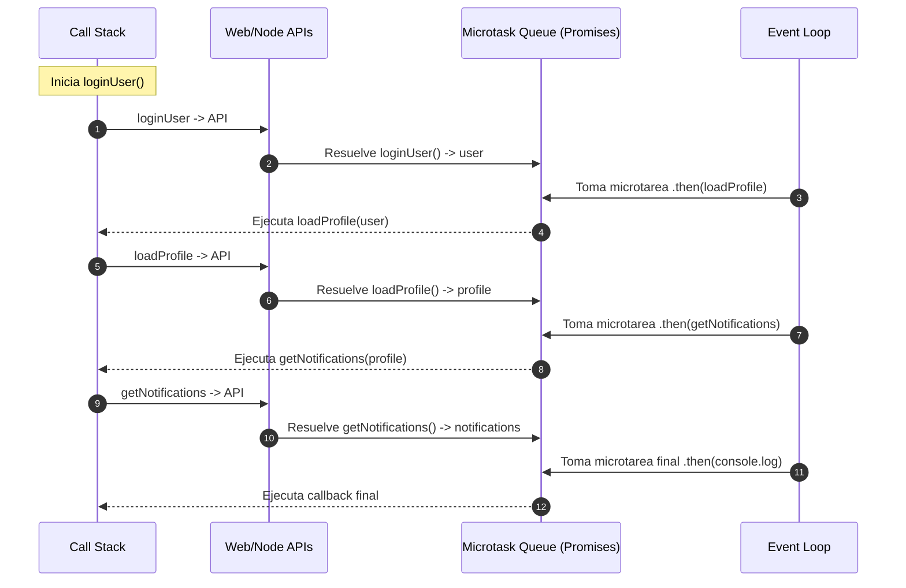
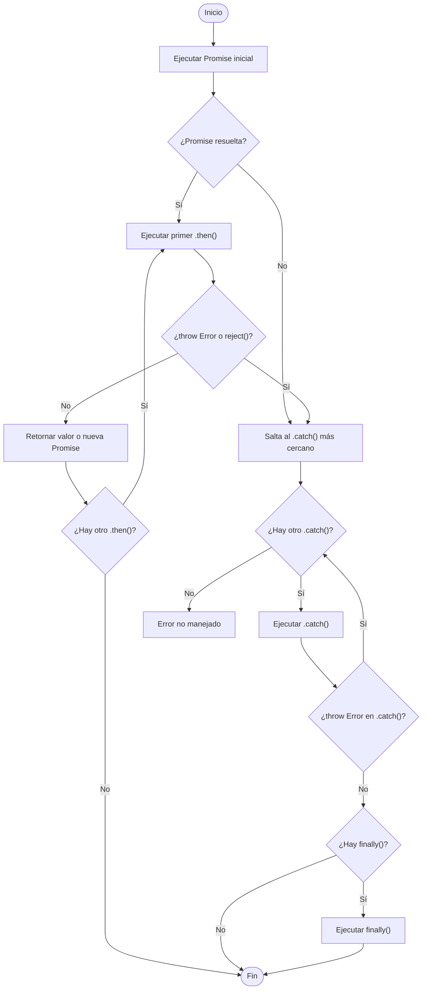

# Encadenamiento de Promises

El **encadenamiento de Promises** consiste en conectar varias operaciones asincrónicas de manera secuencial usando el método `.then()`. Cada `.then()` recibe el resultado de la Promise anterior y devuelve un nuevo valor o una nueva Promise.

Permite estructurar el flujo de forma lineal, evitando el **callback hell** y manejando los errores centralizadamente.

## Ejemplo técnico

```ts showLineNumbers
loginUser("user@example.com")
  .then((user) => loadProfile(user.id))
  .then((profile) => getNotifications(profile.id))
  .then((notifications) => {
    console.log("Notificaciones:", notifications);
  })
  .catch((error) => {
    console.error("Error en la cadena:", error);
  });
```

¿Qué está ocurriendo en cada paso?

1. `loginUser()` devuelve una Promise.
2. El primer `.then()` recibe el user y retorna la Promise de `loadProfile()`.
3. El segundo `.then()` recibe el profile y retorna la Promise de `getNotifications()`.
4. Finalmente, el tercer `.then()` procesa las notificaciones.
5. Cualquier error en la cadena es capturado en el `.catch()` final.

## Diagrama de secuencias



## Valores de retorno en `.then()`

Un `.then()` puede devolver:

1. Un valor normal:

   Se pasa directamente al siguiente `.then()`:

   ```ts showLineNumbers
   Promise.resolve(2)
     .then((num) => num * 2) // devuelve 4
     .then((result) => console.log(result)); // 4
   ```

2. Otra Promise:

   El siguiente `.then()` esperará a que esta Promise se resuelva:

   ```ts showLineNumbers
   Promise.resolve(2)
     .then((num) => Promise.resolve(num * 2))
     .then((result) => console.log(result)); // 4
   ```

3. Nada:

   Si no devuelves nada, el siguiente `.then()` recibirá `undefined`.

## Encadenamiento de errores

Si ocurre un error en cualquier Promise de la cadena, se salta al primer `.catch()`:

```ts showLineNumbers
loginUser("<user@example.com>")
  .then((user) => loadProfile(user.id))
  .then(() => {
    throw new Error("Error forzado");
  })
  .then(() => console.log("Esto no se ejecuta"))
  .catch((err) => console.error("Capturado:", err));
```

Una vez capturado el error, puedes continuar la cadena devolviendo un valor o lanzando otro error.

Por ejemplo, miremos un ejemplo con un flujo de compra:

```ts showLineNumbers
processPayment(order)
  .then((paymentResult) => createInvoice(paymentResult))
  .then((invoice) => sendEmail(invoice))
  .then(() => console.log("Compra completada"))
  .catch((err) => console.error("Error en la compra:", err));
```

Cada paso depende del resultado del anterior. El `.catch()` centraliza el manejo de errores.

## Buenas prácticas en Promise chaining

- Siempre devuelve algo en cada `.then()`: un valor o una Promise.
- Coloca el `.catch()` al final de la cadena para capturar cualquier error.
- No anides `.then()` dentro de otro `.then()`; el objetivo es mantener el flujo plano.
- Usa `finally()` si necesitas ejecutar lógica independientemente del resultado:

Por ejemplo:

```ts showLineNumbers
doTask()
  .then(handleSuccess)
  .catch(handleError)
  .finally(() => console.log("Siempre se ejecuta"));
```

## Relación con el Event Loop

Cada `.then()` se encola en la Microtask Queue cuando la Promise se resuelve. Se ejecutan antes de cualquier macrotarea (por ejemplo, `setTimeout`).

```ts showLineNumbers
setTimeout(() => console.log("Macrotarea"), 0);

Promise.resolve().then(() => console.log("Microtarea 1"));
Promise.resolve().then(() => console.log("Microtarea 2"));

console.log("Síncrono");
```

Salida:

```txt
Síncrono
Microtarea 1
Microtarea 2
Macrotarea
```

## Propagación de errores en Promises chaining



Apliquemos el flujo en un ejemplo:

```ts showLineNumbers
Promise.resolve("Inicio")
  .then((data) => {
    console.log(data);
    throw new Error("Error en el primer then");
  })
  .then(() => {
    console.log("Esto no se ejecuta");
  })
  .catch((error) => {
    console.error("Error capturado:", error.message);
    return "Valor de recuperación";
  })
  .then((data) => {
    console.log("Se recupera el flujo con:", data);
  })
  .finally(() => {
    console.log("Siempre se ejecuta el finally");
  });
```

La salida esperada será:

```txt
Inicio
Error capturado: Error en el primer then
Se recupera el flujo con: Valor de recuperación
Siempre se ejecuta el finally
```

## Referencias

- Flanagan, D. (2020). JavaScript: The Definitive Guide (7th ed.). O’Reilly Media.
- Mozilla Developer Network. (s.f.). [Using Promises](https://developer.mozilla.org/en-US/docs/Web/JavaScript/Guide/Using_promises).
- Mozilla Developer Network. (s.f.). [Promise.prototype.catch()](https://developer.mozilla.org/en-US/docs/Web/JavaScript/Reference/Global_Objects/Promise/catch).
- TypeScript Handbook. (s.f.). [Promises](https://www.typescriptlang.org/docs).
- Google. (s.f.). [JavaScript Style Guide](https://google.github.io/styleguide/jsguide.html).
