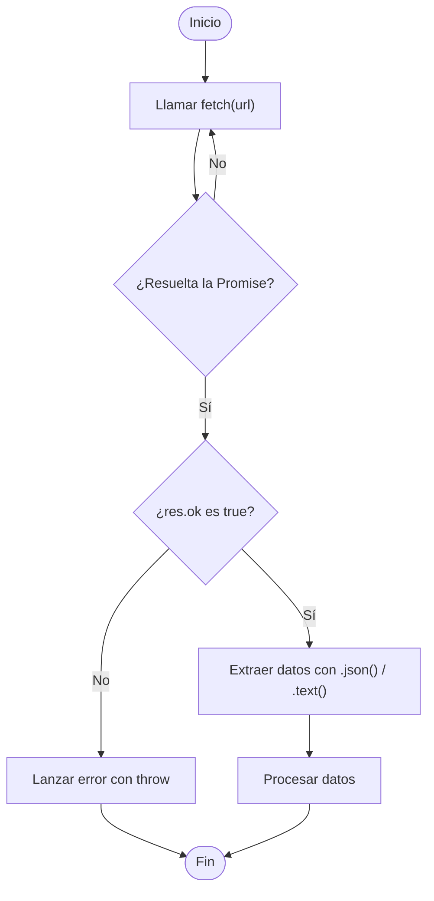

# Fetch API: peticiones GET, POST y manejo de respuestas

La **Fetch API** es una interfaz nativa de JavaScript que permite realizar solicitudes HTTP asincrónicas. Está basada en **Promises**, lo que la hace más moderna y legible que APIs como `XMLHttpRequest`. Permite recuperar datos desde un servidor o enviar información sin necesidad de recargar la página.

## Sintaxis básica

```ts showLineNumbers
fetch(url, opciones?)
  .then((respuesta) => {
    // Manejo de respuesta
  })
  .catch((error) => {
    // Manejo de error
  });
```

## Ejemplo de petición GET básico

Usando **Promise Chaining**:

```ts showLineNumbers
fetch('https://api.example.com/users')
  .then((res) => res.json()) // Convertir respuesta en JSON
  .then((data) => console.log(data))
  .catch((err) => console.error('Error:', err));
```

Usando **async/await**:

```ts showLineNumbers
async function getUsers() {
  try {
    const res = await fetch('https://api.example.com/users');
    if (!res.ok) throw new Error(`Error HTTP: ${res.status}`);
    const data = await res.json();
    console.log(data);
  } catch (err) {
    console.error('Error en la petición:', err);
  }
}
```

## Verbos principales en peticiones HTTP

### GET

El método GET se usa para obtener datos.

```ts showLineNumbers
async function getUserById(id: number) {
  const res = await fetch(`https://api.example.com/users/${id}`);
  if (!res.ok) throw new Error('No se pudo obtener el usuario');
  return res.json();
}
```

- No tiene cuerpo (body)
- Se puede enviar parámetros con **query string** (`?key=value`)

### POST

El método POST se usa para enviar datos (generalmente en formato JSON).

```ts showLineNumbers
async function createUser(user: { name: string; email: string }) {
  const res = await fetch('https://api.example.com/users', {
    method: 'POST',
    headers: {
      'Content-Type': 'application/json', // Indicamos que enviamos JSON
    },
    body: JSON.stringify(user),
  });

  if (!res.ok) throw new Error('Error al crear el usuario');
  return res.json();
}
```

### DELETE

El método DELETE se usa para eliminar recursos.

```ts showLineNumbers
async function deleteUser(id: number): Promise<void> {
  try {
    const response = await fetch(`https://api.example.com/users/${id}`, {
      method: 'DELETE',
      headers: {
        'Content-Type': 'application/json',
        'Authorization': 'Bearer tu_token_aquí' // si aplica
      }
    });

    if (!response.ok) {
      throw new Error(`Error al eliminar: ${response.status}`);
    }

    console.log(`Usuario con ID ${id} eliminado correctamente.`);
  } catch (error) {
    console.error('Error en la petición DELETE:', error);
  }
}
```

### PUT

El método PUT se usa para actualizar recursos.

```ts showLineNumbers
interface User {
  id: number;
  name: string;
  email: string;
}

async function updateUser(user: User): Promise<void> {
  try {
    const response = await fetch(`https://api.ejemplo.com/users/${user.id}`, {
      method: 'PUT',
      headers: {
        'Content-Type': 'application/json',
        'Authorization': 'Bearer tu_token_aquí' // si aplica
      },
      body: JSON.stringify({
        name: user.name,
        email: user.email
      })
    });

    if (!response.ok) {
      throw new Error(`Error al actualizar: ${response.status}`);
    }

    console.log(`Usuario con ID ${usuario.id} actualizado correctamente.`);
  } catch (error) {
    console.error('Error en la petición PUT:', error);
  }
}
```

### PATCH

El método PATCH se usa para actualizar recursos de manera parcial.

```ts showLineNumbers
async function partialUpdateUser(id: number, partialData: Partial<{ name: string; email: string }>): Promise<void> {
  try {
    const response = await fetch(`https://api.example.com/users/${id}`, {
      method: 'PATCH',
      headers: {
        'Content-Type': 'application/json',
        'Authorization': 'Bearer tu_token_aquí' // si aplica
      },
      body: JSON.stringify(partialData)
    });

    if (!response.ok) {
      throw new Error(`Error al actualizar parcialmente: ${response.status}`);
    }

    console.log(`Usuario con ID ${id} actualizado parcialmente.`);
  } catch (error) {
    console.error('Error en la petición PATCH:', error);
  }
}
```

### Otros métodos

- **HEAD:** Igual que `GET`, pero solo devuelve los encabezados (sin cuerpo).
- **OPTION:** Obtener los métodos permitidos para un recurso (útil para CORS).
- **CONNECT:** Establecer un túnel para comunicación segura (usado en proxies HTTPS).
- **TRACE:** Realizar una prueba de diagnóstico devolviendo lo que se recibe.
- **LINK/UNLINK:** Asociar o desasociar recursos (propuestos pero poco usados)

## Manejo de respuestas

La respuesta (`Response`) tiene métodos para extraer el contenido:

- `.json()`: interpreta como JSON
- `.text()`: interpreta como texto plano
- `.blob()`: interpreta como binario (imágenes, PDF)
- `.arrayBuffer()`: datos en buffer
- `.formData()`: datos de formulario

```ts showLineNumbers
const res = await fetch('/archivo.txt');
const contenido = await res.text();
console.log(contenido);
```

## Fetch con async/await



## Buenas prácticas con Fetch

1. Manejar errores de red y de HTTP:

   ```ts
   if (!res.ok) throw new Error(`Error HTTP: ${res.status}`);
   ```

2. Centralizar configuración repetida:

   ```ts
   const BASE_URL = '<https://api.example.com>';
   ```

3. Encapsular en funciones: mejora la reutilización y testeo.
4. Cancelar peticiones innecesarias con AbortController (tema que se abordará después).

## Ejemplo técnico

Veamos un ejemplo de login con manejo de fetch, control de errores y uso de la respuesta entregada por el servicio HTTP:

```ts showLineNumbers
async function login(email: string, password: string) {
  try {
    const res = await fetch('https://api.example.com/login', {
      method: 'POST',
      headers: { 'Content-Type': 'application/json' },
      body: JSON.stringify({ email, password }),
    });

    if (!res.ok) throw new Error('Credenciales inválidas');
    const { token } = await res.json();

    console.log('Token recibido:', token);
    return token;
  } catch (error) {
    console.error('Error en login:', error);
  }
}
```

## Referencias

- Flanagan, D. (2020). JavaScript: The Definitive Guide (7th ed.). O’Reilly Media.
- Mozilla Developer Network. (s.f.). [Fetch API](https://developer.mozilla.org/en-US/docs/Web/API/Fetch_API).
- Mozilla Developer Network. (s.f.). [Response](https://developer.mozilla.org/en-US/docs/Web/API/Response).
- TypeScript Handbook. (s.f.). [Using Fetch](https://www.typescriptlang.org/docs).
- Google. (s.f.). [JavaScript Style Guide](https://google.github.io/styleguide/jsguide.html).
