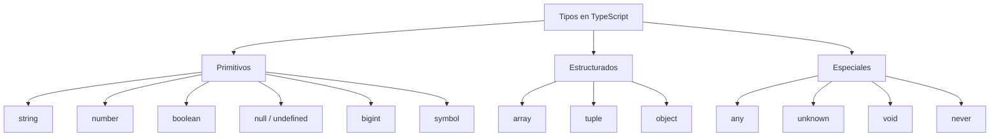
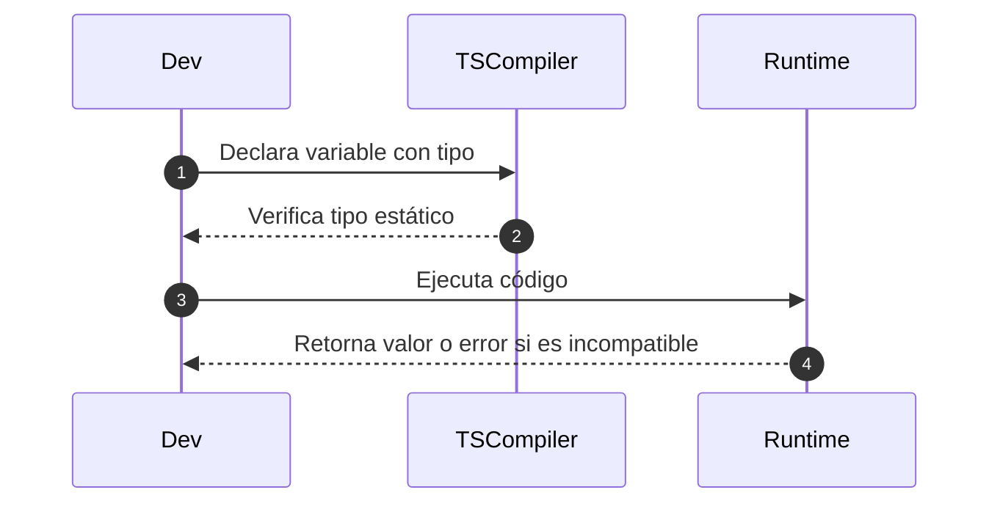

# Tipos primitivos y estructuras

TypeScript es un **superset de JavaScript** que introduce **tipado estático opcional**, lo cual significa que puedes **anotar el tipo de datos que una variable, parámetro o función puede aceptar o devolver**, y el compilador puede detectar errores antes de ejecutar el código.

Esto permite **prevenir errores lógicos** y mejorar la **introspección del código**, especialmente en grandes equipos o proyectos complejos.

## Tipos primitivos en TS

Los tipos primitivos representan los valores más básicos y no estructurados:

|Tipo|Descripción|Ejemplo|
|--|--|--|
|`number`|Números enteros y decimales|`let age: number = 25;`|
|`string`|Texto|`let name: string = "David";`|
|`boolean`|Verdadero o falso|`let active: boolean = true;`|
|`null`|Ausencia de valor|`let x: null = null;`|
|`undefined`|Variable sin asignación|`let y: undefined = undefined;`|
|`bigint`|Números grandes enteros|`let bigNumber: bigint = 12345678901234567890n;`|
|`symbol`|Valor único e inmutable|`const id = Symbol('id');`|

Por ejemplo:

```ts showLineNumbers
let edad: number = 30;
let nombre: string = "Ana";
let esActivo: boolean = false;
let identificador: symbol = Symbol("user");
let superGrande: bigint = 123456789123456789n;
```

## Tipos estructurados

Los tipos estructurados (también llamados compuestos) permiten almacenar y organizar múltiples valores.

1. Arrays (arreglos)

   ```ts showLineNumbers
   let numbers: number[] = [1, 2, 3];
   let names: Array<string> = ["Juan", "Ana"];
   ```

2. Tuplas: Permiten especificar tipos y orden fijo:

   ```ts
   let user: [string, number] = ["Carlos", 35];
   ```

3. Objetos

   ```ts showLineNumbers
   let persona: { nombre: string; edad: number } = {
     nombre: "Ana",
     edad: 30,
   };
   ```

## Tipos especializados

|Tipo|Descripción|
|--|--|
|`any`|Desactiva el sistema de tipos (usar con precaución)|
|`unknown`|Similar a `any`, pero más seguro (requiere verificación de tipo)|
|`void`|Funciones que no retornan valor|
|`never`|Funciones que nunca terminan correctamente (errores o bucles infinitos)|

Por ejemplo:

```ts showLineNumbers
function log(mensaje: string): void {
  console.log(mensaje);
}

function error(): never {
  throw new Error("Error crítico");
}
```

## Inferencia vs Declaración de tipos

TypeScript puede inferir el tipo automáticamente:

```ts
let city = "Tunja"; // TS infiere que es string
```

Pero se recomienda declarar tipos explícitamente en funciones, clases o estructuras complejas para mayor claridad.

## Clasificación de tipos en TS



## Asignación de tipos



## Diferencias entre `any` y `unknown`

|Característica|`any`|`unknown`|
|--|--|--|
|Flexibilidad|Total|Controlada|
|Seguridad de tipos|Ninguna|Alta (requiere verificación previa)|
|Uso recomendado|Solo migraciones rápidas|Código seguro y validado|

## Principios aplicados

|Principio|Aplicación|
|--|--|
|**Clean Code**|Tipos explícitos mejoran la legibilidad y documentación del código|
|**SRP (S)**|Permite funciones con un propósito bien tipado y claro|
|**Open/Closed (O)**|Se pueden extender tipos sin modificar estructuras base|
|**Clean Architecture**|Tipos y contratos definen los límites claros entre capas|

## Referencias

- Bierman, G., Abadi, M., & Torgersen, M. (2014). Understanding TypeScript. Microsoft Research.
- Microsoft. (s.f.). [TypeScript Handbook: Basic Types](https://www.typescriptlang.org/docs/handbook/basic-types.html).
- Mozilla Developer Network. (s.f.). [JavaScript Data Types and Structures](https://developer.mozilla.org/en-US/docs/Web/JavaScript/Data_structures).
- Zakas, N. C. (2012). Maintainable JavaScript: Writing Readable Code. O'Reilly Media.
- Freeman, E., & Robson, E. (2014). Head First JavaScript Programming. O’Reilly Media.
