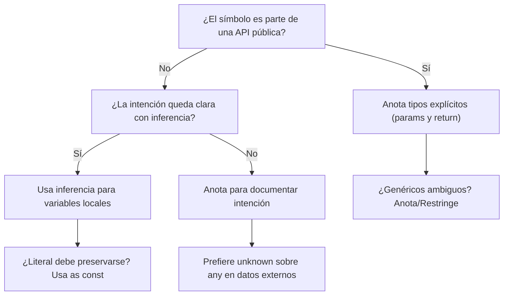
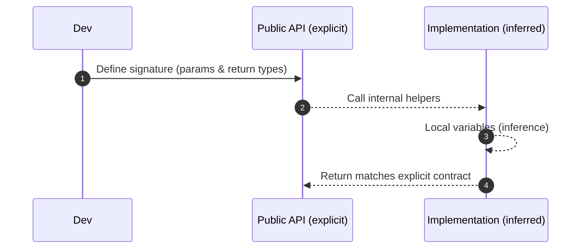

# Inferencia de tipos vs anotación explícita

- **Inferencia:** TypeScript deduce el tipo a partir del valor o del contexto. Es potente, concisa y suele bastar para variables locales y expresiones internas.
- **Anotación explícita:** el programador declara el tipo. Es esencial en fronteras públicas (APIs, módulos, contratos) y para controlar el diseño cuando la inferencia no refleja la intención.

:::info

**Regla práctica:** Infiera dentro de la implementación, anote en las fronteras. *(“Infer inside, annotate at the edges.”)*

:::

## Inferencia en variables y expresiones

```ts
// Local variables – concise & safe
const port = 8080;          // inferred: number
let active = true;          // inferred: boolean
const message = 'OK';       // inferred: "OK" (literal) → widened to string if needed

// Contextual inference inside expressions
const users = ['Ana', 'Luis']; // inferred: string[]
const coords = [10, 20] as const; // inferred: readonly [10, 20]
```

## Widening vs literal types

- `const msg = 'READY'`: tipo literal 'READY'
- `let msg = 'READY'`: se ensancha (widen) a string

**Tip:** Usa `as const` para congelar literales cuando quieras preservar su tipo exacto en configuraciones/constantes.

## Inferencia contextual (parámetros y lambdas)

```ts showLineNumbers
const names = ['David', 'Tommy'];
names.forEach(n => {
  // `n` is inferred as string by context
  console.log(n.toUpperCase());
});
```

Aquí el compilador **deduce** `n: string` por el tipo de `names`.

## Inferencia en funciones (retorno) vs anotación explícita

```ts showLineNumbers
// 1) Internal helper – inference is fine
function double(n: number) {
  return n * 2; // inferred return: number
}

// 2) Public API – explicit return improves contracts
export function toSlug(input: string): string {
  return input.trim().toLowerCase().replace(/\s+/g, '-');
}
```

- **Para funciones exportadas y métodos públicos:** anota el tipo de retorno para fijar el contrato y evitar que refactors cambien silenciosamente la API.
- **Para utilidades internas:** la inferencia del retorno suele ser suficiente.

## Inferencia en genéricos (con límites)

```ts showLineNumbers
/**
 * Map over a list with a transformer.
 * @param items Input list
 * @param fn Transformer
 */
export function mapOf<T, U>(items: T[], fn: (x: T) => U): U[] {
  return items.map(fn);
}

// Call-site infers T = number, U = string
const lengths = mapOf([10, 20, 30], n => `#${n}`); // string[]
```

- TypeScript infiera `T` y `U` desde los argumentos.
- Si el uso es ambiguo, anota el genérico: `mapOf<number, string>(...)`.

## Objetos y "shape" inferidos vs contratos explícitos

```ts showLineNumbers
// Inference for internal data
const config = {
  retries: 3,
  strategy: 'exponential',
}; // inferred: { retries: number; strategy: string }

// Public contract → prefer interface/type
export interface RetryConfig {
  retries: number;
  strategy: 'constant' | 'exponential';
}

export function withRetry(cfg: RetryConfig) { /* ... */ }
```

Cuando el objeto cruza una **frontera** (entrada de función pública, DTO, respuesta de capa de infraestructura), usa **tipos explícitos** (interfaces/aliases) para fijar el contrato.

## Cuándo anotar explícitamente

- **Fronteras públicas:** firmas de funciones/métodos exportados, controllers, use-cases, adapters.
- **Tipos de retorno** en APIs públicas.
- **Tipos genéricos** cuando la inferencia es ambigua.
- **Uniones/Intersecciones** complejas para documentar intención.
- `unknown` sobre `any` al recibir datos externos (validar antes de usar).

## Cuándo permitir inferencia

- Variables locales, resultados intermedios.
- Callbacks con contexto claro (map, filter, reduce).
- Implementaciones privadas dentro de un módulo/capa.

## Ejemplo integral (Clean Architecture)

El objetivo del ejemplo es mostrar explícito en edges e inferencia dentro de la implementación.

```ts title="domain/entities/order.ts" showLineNumbers
export interface Order {
  id: string;
  total: number;
  status: 'PENDING' | 'PAID' | 'CANCELLED';
}
```

```ts title="domain/ports/order.repository.ts" showLineNumbers
export interface OrderRepository {
  findById(id: string): Promise<Order | null>;
  save(order: Order): Promise<void>;
}
```

```ts title="application/usecases/pay_order.ts" showLineNumbers
export class PayOrder {
  constructor(private readonly repo: OrderRepository) {}

  /**
   * Public API of the use case — explicit types at the edge.
   */
  async execute(orderId: string): Promise<Order> {
    const order = await this.repo.findById(orderId);
    if (!order) throw new Error('Order not found');

    // Internal variables — inference is fine
    const updated = { ...order, status: 'PAID' as const };

    await this.repo.save(updated);
    return updated; // return type is explicitly Promise<Order>
  }
}
```

```ts title="infrastructure/repositories/in_memory_order.repository.ts" showLineNumbers
import { Order, OrderRepository } from 'domain/...';

export class InMemoryOrderRepo implements OrderRepository {
  private store = new Map<string, Order>(); // inferred Map<string, Order>

  findById(id: string): Promise<Order | null> {
    return Promise.resolve(this.store.get(id) ?? null);
  }

  save(order: Order): Promise<void> {
    this.store.set(order.id, order);
    return Promise.resolve();
  }
}
```

- **Dominio/puertos:** contratos explícitos.
- **Casos de uso:** firmas públicas explícitas; variables internas inferidas.
- **Infraestructura:** implementaciones con inferencias locales.

## Errores comunes y cómo evitarlos

1. `any` implícito (por `noImplicitAny: false`): Activa `"noImplicitAny": true` en `tsconfig.json`. Si necesitas “caja negra”, usa `unknown` y valida.
2. Arrays vacío sin tipo:

   ```ts showLineNumbers
   let xs = [];              // any[]  (riesgoso)
   const ys: number[] = [];  // explícito
   ```

3. **Retornos accidentales** por refactor: Sin tipo explícito, un cambio interno puede alterar el tipo de retorno. Anota retornos en funciones exportadas.
4. Uniones demasiado anchas por inferencia:

   ```ts showLineNumbers
   const mixed = [1, 'a'];    // (string | number)[]
   const strict = [1, 2] as const; // readonly [1, 2]
   ```

5. Perder literal types con `let`: Usa `const` o `as const` cuando quieras preservar literales.

## Patrón "type guards" con `unknown`

Al patrón `type guards` se le conoce cómo "type guards" (guardias de tipo). Es una técnica para comprobar si un valor de tipo `unknown` puede ser de un tipo específico. Esto se logra mediante una función que devuelve un valor de tipo booleano que indica si el valor de entrada es de un tipo específico. Si el valor es de ese tipo, la función devuelve `true`, de lo contrario devuelve `false`. Si el valor es de ese tipo, puedes usar el valor de entrada como si fuera de ese tipo. Por ejemplo:

```ts showLineNumbers
type User = { id: string; name: string };

function isUser(x: unknown): x is User {
  return !!x && typeof x === 'object'
    && typeof (x as any).id === 'string'
    && typeof (x as any).name === 'string';
}

export function parseUser(input: unknown): User {
  if (!isUser(input)) throw new Error('Invalid User');
  return input; // now input is User
}
```

- Recibir `unknown` obliga a **verificar**.
- Tras el *type guard*, el compilador **refina** el tipo (narrowing).

## Decidir entre inferencia y anotación



## Edge vs Inside



## Buenas prácticas

- **Clean Code:** menos ruido donde la inferencia es clara; contratos explícitos donde importa la comunicación.
- **SRP (S):** los tipos documentan responsabilidad; “una función, un propósito”.
- **OCP (O):** APIs tipadas son extensibles y seguras ante cambios internos.
- **DIP (D):** programa contra interfaces explícitas, no implementaciones; la inferencia queda para la “cocina interna”.
- **Clean Architecture:** dominio y puertos con tipos explícitos; infraestructura y aplicación aprovechan inferencia local.

## Referencias

- Microsoft. (s.f.). [TypeScript Handbook: Basic & Variable Declarations, Functions, Generics, Type Inference](https://www.typescriptlang.org/docs/).
- Bierman, G., Abadi, M., & Torgersen, M. (2014). Understanding TypeScript. Microsoft Research.
- Flanagan, D. (2020). JavaScript: The Definitive Guide (7.ª ed.). O’Reilly Media.
- Zakas, N. C. (2012). Maintainable JavaScript: Writing Readable Code. O’Reilly Media.
- Google. (s.f.). [JavaScript Style Guide](https://google.github.io/styleguide/jsguide.html).
