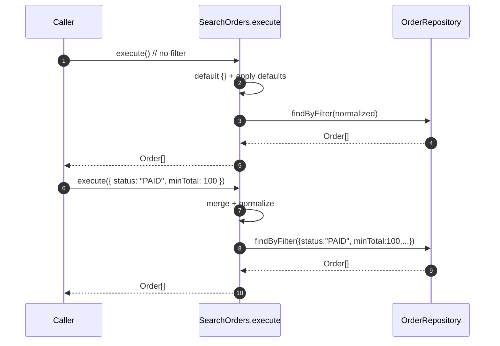

# Tipado en funciones y parámetros opcionales

El contrato de una función (sus parámetros y su tipo de retorno) es una **frontera de arquitectura**. Tipar bien estas fronteras:

- Evita ambigüedad y errores de integración.
- Documenta la intención del diseño.
- Mejora la refactorización segura y la testabilidad.

Regla práctica: **anota explícitamente en las fronteras públicas** (exports, controladores, use cases) y **aprovecha la inferencia dentro de las implementaciones**.

## Firmas de funciones

1. Declaración y expresión de función:

   ```ts showLineNumbers
   // Declaration
   export function toSlug(input: string): string {
     return input.trim().toLowerCase().replace(/\s+/g, "-");
   }

   // Function type + arrow
   export const normalize: (s: string) => string = (s) =>
     s.normalize("NFKC").trim();
   ```

2. Parámetros nombrados vs objeto de opciones: Los parámetros nombrados son dimples, directos, e ideales para entre 1 a 3 argumentos. Por otro lado, los objeto de opciones son escalables, permiten opciones opcionales y valores por defecto claros.

   ```ts showLineNumbers
   // Options object with optional properties
   export interface PaginationOptions {
     page?: number;           // optional
     pageSize?: number;       // optional
     includeTotal?: boolean;  // optional
   }

   export function paginate<T>(
     data: T[],
     { page = 1, pageSize = 10, includeTotal = false }: PaginationOptions = {}
   ): { items: T[]; total?: number } {
     const start = (page - 1) * pageSize;
     const items = data.slice(start, start + pageSize);
     return includeTotal ? { items, total: data.length } : { items };
   }
   ```

   Con destructuring y defaults, los opcionales quedan resueltos sin `if` verbosos.

## Parámetros opcionales

1. Parámetro opcional con `?`

   ```ts showLineNumbers
   export function greet(name: string, title?: string): string {
     return title ? `Hello, ${title} ${name}` : `Hello, ${name}`;
   }
   // `title` tiene tipo: string | undefined
   ```

   Los opcionales deben ir al final de la lista de parámetros.

2. Parámetro con valor por defecto

   ```ts showLineNumbers
   export function connect(url: string, timeoutMs: number = 5000): string {
       return `Connecting to ${url} with timeout=${timeoutMs}ms`;
   }
   // timeoutMs es "opcionales a la llamada"; dentro de la función se trata como number
   ```

   Si el llamador omite el argumento o pasa `undefined`, se aplica el default.

3. Unión explícita con `undefined`

   ```ts showLineNumbers
   export function parsePort(input: string | undefined): number {
     const raw = input ?? "8080";
     const port = Number(raw);
     if (!Number.isFinite(port)) throw new Error("Invalid port");
     return port;
   }
   ```

¿Cuáles son las diferencias entre los 3?

|Forma|Tipo dentro de la función|¿Se puede omitir al llamar?|¿Default automático?|
|--|--|--|--|
|`param?: T`|`T \| undefined`|Sí|No|
|`param = default`|`T`|Sí|Sí (si omitido o `undefined`)|
|`param: T \| undefined`|`T \| undefined`|Sí (porque `undefined` válido)|No|

## Ejemplo técnico

```ts title="domain/entities/Order.ts" showLineNumbers
export interface Order {
  id: string;
  customerId: string;
  total: number;
  status: "PENDING" | "PAID" | "CANCELLED";
  createdAt: Date;
}
```

```ts title="domain/ports/OrderRepository.ts" showLineNumbers
export interface OrderRepository {
  findByFilter(filter: OrderFilter): Promise<Order[]>;
}

export interface OrderFilter {
  customerId?: string;
  status?: Order["status"];
  minTotal?: number;
  maxTotal?: number;
  from?: Date;
  to?: Date;
}
```

```ts title="application/usecases/SearchOrders.ts" showLineNumbers
export class SearchOrders {
  constructor(private readonly repo: OrderRepository) {}

  // Public edge: explicit types + options object with optionals
  async execute(filter: OrderFilter = {}): Promise<Order[]> {
    const normalized: OrderFilter = {
      ...filter,
      minTotal: filter.minTotal ?? 0,
      maxTotal: filter.maxTotal ?? Number.POSITIVE_INFINITY,
    };
    return this.repo.findByFilter(normalized);
  }
}
```

Claves de Clean Architecture aplicadas:

- **Dominio/puertos:** contratos explícitos con propiedades opcionales.
- **Use case:** defaults internos con ?? para asegurar invariantes; evita null.
- **Infraestructura:** interpreta los opcionales (query params, índices, rangos).

## Opción omitida vs provista



## Referencias

- Microsoft. (s.f.). [TypeScript Handbook: Functions, Optional Parameters, Default Parameters, Function Types](https://www.typescriptlang.org/docs/).
- Flanagan, D. (2020). JavaScript: The Definitive Guide (7.ª ed.). O’Reilly Media.
- Zakas, N. C. (2012). Maintainable JavaScript: Writing Readable Code. O’Reilly Media.
- Freeman, E., & Robson, E. (2014). Head First JavaScript Programming. O’Reilly Media.
- Google. (s.f.). [JavaScript Style Guide](https://google.github.io/styleguide/jsguide.html).
