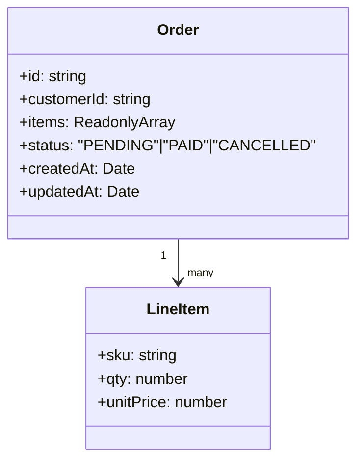
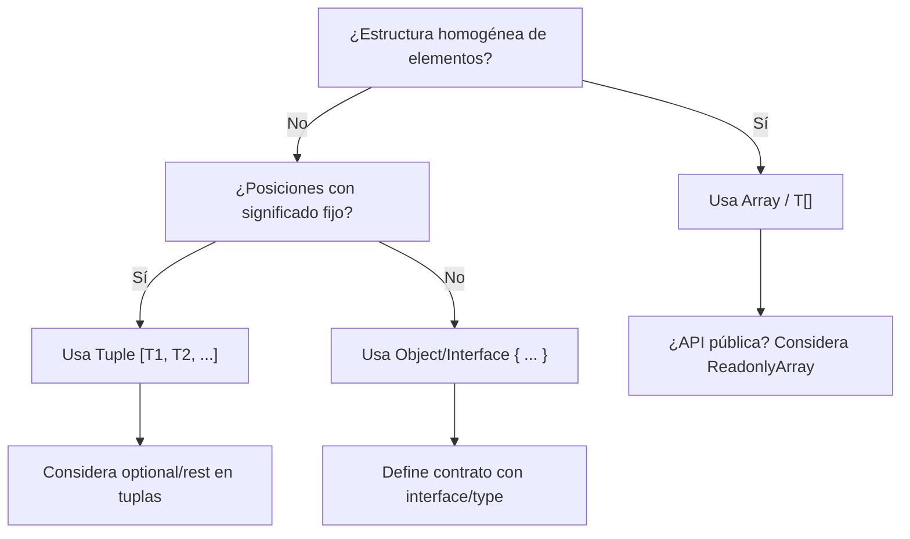

# Tipado de arreglos, tuplas y objetos

- **Arreglos (`T[]`, `Array<T>`)**: colecciones homogéneas, tamaño variable, API funcional (map, filter, reduce).
- **Tuplas (`[T1, T2, ...]`)**: tamaño y posiciones fijos (o parcialmente fijos), cada índice tiene tipo específico; soportan opcionalidad y rest.
- **Objetos (`{ ... }`, `interface`):** estructuras con propiedades nombradas; base de contratos (DTOs, entidades, puertos).

Regla práctica:

- Arreglo = “lista de cosas del mismo tipo”.
- Tupla = “n posiciones con significado/semántica por índice”.
- Objeto = “campos nombrados con contrato explícito”.

## Arreglos

1. Declaración y lectura

   ```ts showLineNumbers
   // Dos notaciones equivalentes:
   const numsA: number[] = [1, 2, 3];
   const numsB: Array<number> = [1, 2, 3];

   // La API funcional preserva los tipos
   const doubled = numsA.map(n => n * 2);          // number[]
   const evens = numsA.filter(n => n % 2 === 0);   // number[]
   ```

2. Arreglos de uniones y diccionarios

   ```ts showLineNumbers
   const mix: Array<string | number> = ['A', 1, 'B', 2]; // (string | number)[]

   type UserId = string;
   type User = { id: UserId; name: string };

   const byId: Record<UserId, User> = {
     'u1': { id: 'u1', name: 'Ana' },
     'u2': { id: 'u2', name: 'Luis' },
   };
   ```

3. `readonly` y la inmutabilidad superficial

   ```ts showLineNumbers
   const brands: readonly string[] = ['Apple', 'Samsung'];
   // brands.push('Sony'); // Error: método mutante bloqueado

   // Congelar literales y preservar tipos exactos
   const rgb = [255, 128, 64] as const; // readonly [255, 128, 64]
   ```

   Tip: `readonly T[]` inhabilita métodos mutantes (p. ej., `push`). Para inmutabilidad profunda, use utilitarios (p. ej., `Readonly<T>` en objetos, o librerías).

## Tuplas

1. Tupla básica y semántica por posición

   ```ts showLineNumbers
   type GeoPoint = [lat: number, lon: number]; // named elements (TS 4.0+)
   const bogota: GeoPoint = [4.711, -74.072];
   ```

2. Elementos opcionales y `rest` en tuplas

   ```ts showLineNumbers
   // Elementos opcionales de la tupla
   type HttpLog = [status: number, path: string, ms?: number];

   const a: HttpLog = [200, '/health'];
   const b: HttpLog = [200, '/users', 12];

   // Rest element al final
   type CsvRow = [id: string, ...values: (number | string)[]];
   const row: CsvRow = ['r1', 10, 'ok', 22];
   ```

3. Tupla vs arreglo

   - **Tupla:** longitud conocida / posiciones con significado (p. ej., `[status, payload]`).
   - **Arreglo:** longitud dinámica / elementos homogéneos (p. ej., `Order[]`).

## Objetos

1. Interfaces y aliases (contratos explícitos)

   ```ts showLineNumbers
   export interface Address {
     street: string;
     city: string;
     country: string;
     postalCode?: string; // optional
   }

   export interface Customer {
     readonly id: string;     // no puede ser reasignado
     name: string;
     email: string;
     address?: Address;       // propiedad opcional
   }
   ```

2. Utilitarios de tipos (mapeados)

   ```ts showLineNumbers
   type CustomerDTO   = Readonly<Customer>;       // all props readonly (shallow)
   type CustomerInput = Omit<Customer, 'id'>;     // remover 'id' cuando se crea
   type PartialAddress = Partial<Address>;        // todos son opcionales
   type StrictPick = Pick<Customer, 'id' | 'email'>;
   ```

3. Index signatures vs `Record`

   ```ts showLineNumbers
   // Index signature: flexible pero menos estricto per-key
   interface Env {
     [key: string]: string | undefined;
   }

   const env: Env = { NODE_ENV: 'production', DEBUG: undefined };

   // Record: dominio estricto de las llaves conocidas
   type FeatureFlags = 'audit' | 'beta' | 'darkMode';
   type Flags = Record<FeatureFlags, boolean>;

   const flags: Flags = { audit: true, beta: false, darkMode: true };
   ```

4. Exactitud y "excess property checks"

   ```ts showLineNumbers
   interface User {
     id: string;
     name: string;
   }

   const okUser: User = { id: 'u1', name: 'Ana' };

   // La comprobación de propiedad excesiva se activa en literales:
   const badUser: User = { id: 'u2', name: 'Luis', role: 'admin' as any }; // Incorrecto
   ```

   Cuando asignas literales a tipos de objeto, TS detecta propiedades extra inesperadas. Útil para atrapar errores temprano.

## Ejemplo técnico

```ts title="domain/entities/Order.ts" showLineNumbers
export interface LineItem {
  sku: string;
  qty: number;
  unitPrice: number;
}

export interface Order {
  id: string;
  customerId: string;
  items: ReadonlyArray<LineItem>; // immutable API surface
  status: 'PENDING' | 'PAID' | 'CANCELLED';
  createdAt: Date;
  updatedAt: Date;
}
```

```ts title="application/usecases/CalculateTotal.ts" showLineNumbers
export function calculateTotal(items: ReadonlyArray<LineItem>): number {
  return items.reduce((sum, it) => sum + it.qty * it.unitPrice, 0);
}
```

```ts title="infrastructure/repositories/InMemoryOrderRepo.ts"
export class InMemoryOrderRepo {
  private store = new Map<string, Order>(); // inferred Map<string, Order>

  save(order: Order): void {
    this.store.set(order.id, order);
  }

  findById(id: string): Order | null {
    return this.store.get(id) ?? null;
  }
}
```

- **Arreglos:** `ReadonlyArray<LineItem>` en la superficie pública para prevenir mutaciones accidentales (DIP/SRP).
- **Objetos:** contratos explícitos entre capas.
- **Tuplas:** útiles para logs/eventos o resultados compactos (`[status, payload]`), sin sobrediseñar DTOs.

## Patrones útiles con arrays/tuplas/objetos

1. Resultado tipado con tupla (status + payload)

   ```ts showLineNumbers
   // Representa un resultado exitoso con un valor de tipo T
   type Success<T> = [status: 'ok', value: T];

   // Representa un resultado fallido con un error de tipo E
   type Failure<E> = [status: 'error', error: E];

   // Unión de ambos posibles resultados
   type Result<T, E = Error> = Success<T> | Failure<E>;

   // Función para construir un resultado exitoso
   export const createSuccess = <T>(value: T): Success<T> => ['ok', value];

   // Función para construir un resultado fallido
   export const createFailure = <E>(error: E): Failure<E> => ['error', error];

   // Extrae el valor de un resultado exitoso o lanza el error si es fallido
   function unwrapResult<T, E>(result: Result<T, E>): T {
     const [status, payload] = result;

     if (status === 'ok') {
       return payload as T;
     }

     throw payload;
   }
   ```

2. Normalización inmutable con objetos

   ```ts showLineNumbers
   export function normalizeUsers(users: ReadonlyArray<{ id: string; name: string }>) {
     const byId: Record<string, { id: string; name: string }> = {};
     for (const u of users) byId[u.id] = u;
     const allIds = users.map(u => u.id) as readonly string[];
     return { byId, allIds } as const; // preserva exactitud
   }
   ```

## Diagrama de clases: Entidad con array y objeto anidado



## ¿Cuándo usar arreglo, tupla u objeto?



## Principios aplicables

- **Clean Code:**
  - **ReadonlyArray** en APIs para evitar efectos colaterales.
  - Tipos precisos (tuplas vs arrays) comunican intención.
- **SRP (S) / OCP (O):**
  - Contratos explícitos (interfaces) facilitan extensiones sin romper consumidores.
- **DIP (D):**
  - Dependencias contra **interfaces** (entidades/repositorios), no implementaciones concretas.
- **Clean Architecture:**
  - Dominio con entidades inmutables y arreglos readonly en la superficie pública.
  - Aplicación orquesta; Infraestructura traduce a persistencia/HTTP.

## Referencias

- Microsoft. (s.f.). [TypeScript Handbook: Interfaces, Arrays, Tuples, Utility Types](https://www.typescriptlang.org/docs/).
- Flanagan, D. (2020). JavaScript: The Definitive Guide (7.ª ed.). O’Reilly Media.
- Mozilla Developer Network. (s.f.). [Indexed collections and keyed collections](https://developer.mozilla.org/en-US/docs/Web/JavaScript).
- Zakas, N. C. (2012). Maintainable JavaScript: Writing Readable Code. O’Reilly Media.
- Freeman, E., & Robson, E. (2014). Head First JavaScript Programming. O’Reilly Media.
