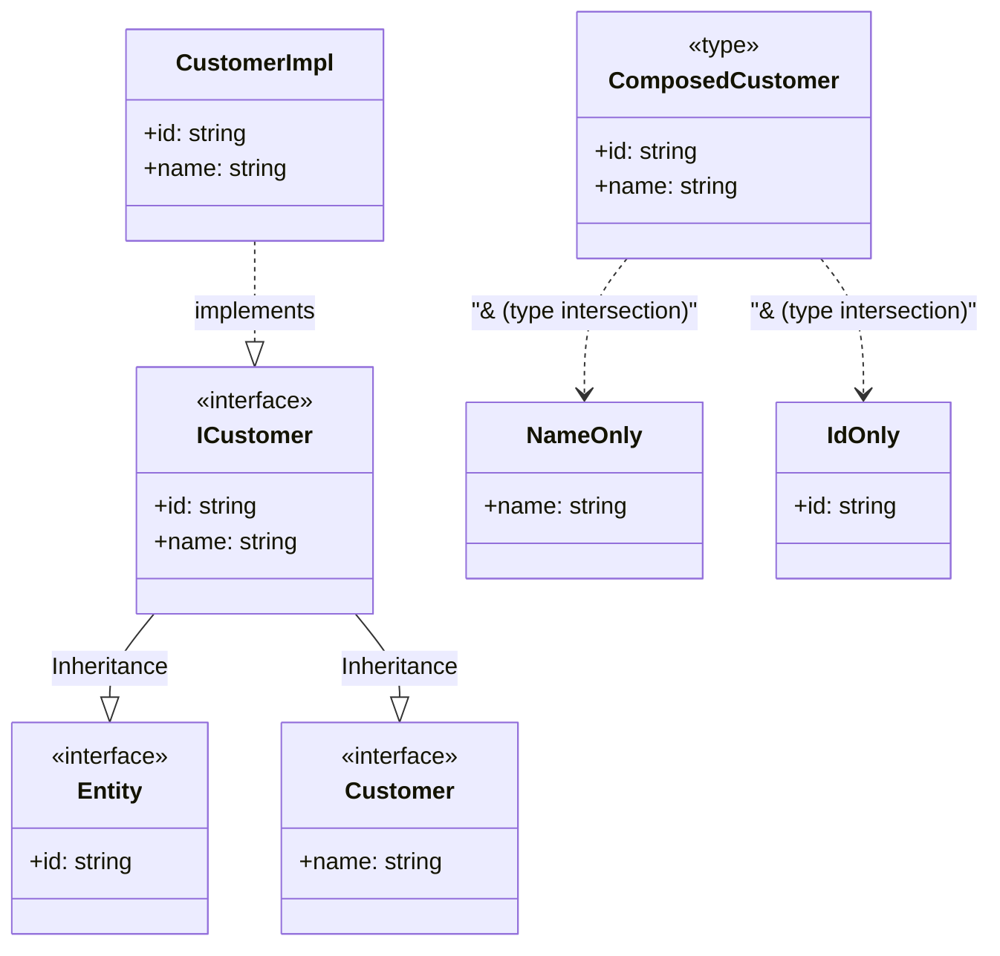

# Diferencias entre type e interface

- `interface`: Contratos **orientados a objetos** y **APIs públicas** (clases, puertos, adapters). Soporta **extensión** y **declaration merging** (puede “reabrirse”).
- `type`: **Composición** y **modelado** avanzado: uniones, tuplas, mapped types, transformaciones complejas. **No** admite merging.

:::success

Memoria rápida: **“interface para contratos; type para composición”**.

:::

## Lo que ambos pueden hacer

- Describir **formas de objetos**.
- Ser **implementados** por clases (una clase puede `implements` un `type` si este resuelve a un objeto).
- Definir **call signatures** y **construct signatures**.
- Participar en **herencia/extensión** (interfaces con `extends`, types con intersecciones `&`).

## Diferencias clave

1. Declaration Merging (solo `interface`)

   ```ts showLineNumbers
   // Archivo A
   interface User {
     id: string;
   }

   // Archivo B (merge)
   interface User {
     name: string;
   }

   // Resultado: interface User { id: string; name: string }
   ```

   Útil para **augmentations** (p. ej., ampliar tipos de librerías o del DOM). `type` no se puede reabrir: una redefinición del mismo nombre es error.

2. Uniones y Tuplas (solo `type`)

   ```ts showLineNumbers
   // Discriminated union
   type Payment =
     | { kind: 'card'; last4: string }
     | { kind: 'cash'; change: number };

   // Tuple
   type Point = [x: number, y: number];
   ```

   Si necesitas **uniones** o **tuplas**, elige `type`.

3. Mapped Types (solo `type`)

   ```ts showLineNumbers
   type ReadonlyRecord<K extends string, V> = {
     readonly [P in K]: V;
   };

   type Flags = ReadonlyRecord<'audit' | 'beta' | 'dark', boolean>;
   ```

   Para transformaciones genéricas a partir de claves, `type` es la herramienta natural.

4. Extensión/Composición

   ```ts showLineNumbers
   // interface: clásica herencia nominal
   interface Entity { id: string }
   interface Customer extends Entity { name: string }

   // type: composición estructural
   type EntityT = { id: string };
   type CustomerT = EntityT & { name: string };
   ```

   Semánticamente similares, elige por intención (contrato vs composición).

5. Ampliaciones del ecosistema (DOM/Node/Libs)

   ```ts showLineNumbers
   // Augment global Window (sólo con interface)
   declare global {
     interface Window {
       __APP_VERSION__: string;
     }
   }
   ```

   Par augmentations de tipos existentes, `interface` es la mejor opción.

## Decisión arquitectónica

- **Domain / Ports**: `interface` (contratos estables y ampliables).
- **DTOs, Responses, combinaciones**: `type` (uniones, transformaciones y exactitud).
- **Adapters / Infra**: libre, pero prioriza contratos públicos con interface.

## Ejemplo Técnico

import Tabs from "@theme/Tabs"
import TabItem from "@theme/TabItem"

<Tabs>
<TabItem value="interface" label="Contrato de repositorio (interface) + DTO (Type)">

```ts title="domain/entities/Order.ts" showLineNumbers
export interface Order {
  id: string;
  total: number;
  status: 'PENDING' | 'PAID' | 'CANCELLED';
}
```

```ts title="application/dto/OrderDTO.ts" showLineNumbers
export type OrderDTO = Readonly<{
  id: string;
  total: number;
  status: 'PENDING' | 'PAID' | 'CANCELLED';
}>;
```

```ts title="domain/ports/OrderRepository.ts" showLineNumbers
export interface OrderRepository {
  findById(id: string): Promise<Order | null>;
  save(order: OrderDTO): Promise<void>;
}
```

- **SRP/OCP:** contratos explícitos y estables (`interface`).
- **DIP:** capas superiores dependen de abstracciones (`OrderRepository`).
- DTO como type para expresar inmutabilidad y facilitar transformaciones.

</TabItem>
<TabItem value="type" label="Uniones discriminadas para casos de uso (Type)">

```ts title="application/usecases/PayOrder.types.ts" showLineNumbers
export type PayOrderResult =
  | { kind: 'ok'; orderId: string }
  | { kind: 'invalid-state'; reason: string }
  | { kind: 'not-found' };
```

Comunicación clara de **ramas de resultado** (excelente para `switch` exhaustivo).

</TabItem>
<TabItem value="type2" label="Mapped types utilitarias (Type)">

```ts showLineNumbers
type ApiResponse<T> = Readonly<{
  data?: T;
  error?: string;
  timestamp: string;
}>;
```

</TabItem>
<TabItem value="interface2" label="Contratos consumidos por clases (Interface)">

```ts showLineNumbers
export interface Clock {
  now(): Date;
}

export class SystemClock implements Clock {
  now(): Date {
    return new Date();
  }
}
```

</TabItem>
<TabItem value="syntactic" label="Ejemplo sintético">

```ts
/**
 * Publico, contrato estable para servicios -> interface
 */
export interface EmailService {
  send(to: string, subject: string, body: string): Promise<void>;
}

/**
 * Forma de los datos para inputs/outputs, unions/tuples -> type
 */
export type EmailRequest =
  | { kind: 'single'; to: string; subject: string; body: string }
  | { kind: 'bulk'; recipients: string[]; subject: string; templateId: string };

/**
 * Tipos mapeados/utilitarios -> type
 */
export type ReadonlyDeep<T> = {
  readonly [K in keyof T]: ReadonlyDeep<T[K]>;
};

/**
 * Interface puede ser augmented (library extension)
 */
declare global {
  interface Console {
    success(msg: string): void;
  }
}
```

</TabItem>
</Tabs>

## Extensión con `interface` vs intersección con `type`



## Referencias

- Microsoft. (s.f.). [TypeScript Handbook: Interfaces, Type Aliases, Advanced Types](https://www.typescriptlang.org/docs/).
- Bierman, G., Abadi, M., & Torgersen, M. (2014). Understanding TypeScript. Microsoft Research.
- Flanagan, D. (2020). JavaScript: The Definitive Guide (7.ª ed.). O’Reilly Media.
- Zakas, N. C. (2012). Maintainable JavaScript: Writing Readable Code. O’Reilly Media.
- Google. (s.f.). [JavaScript Style Guide](https://google.github.io/styleguide/jsguide.html).
