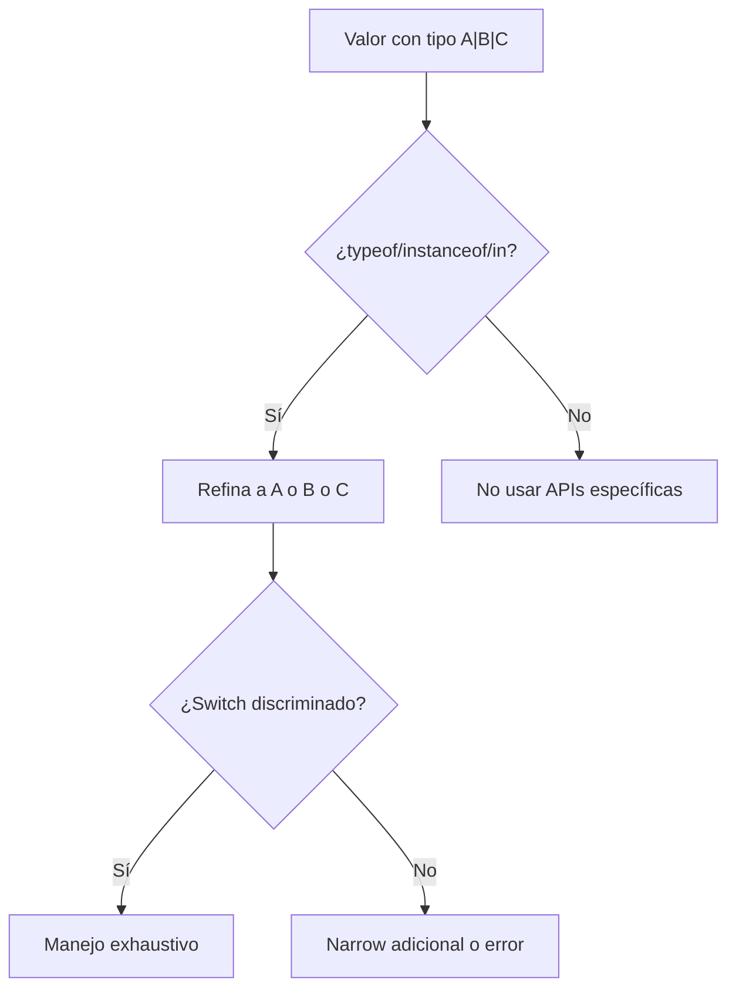
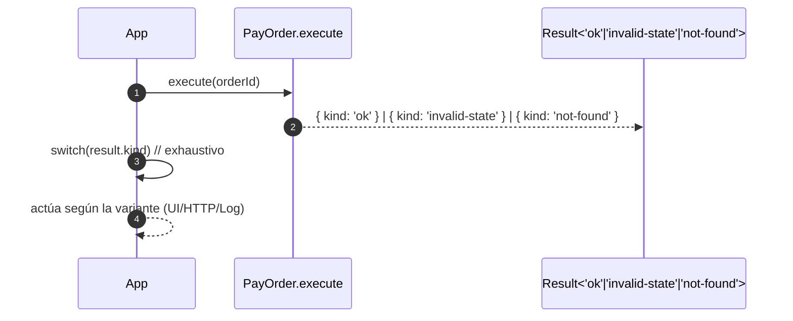

# Union types (|)

Un **union type** describe un valor que puede ser uno entre varios tipos posibles. Por ejemplo: `string | number` significa "string o number"

```ts
let id: string | number;
id = 'u-123';
id = 42; // ambas válidas
```

Los unions capturan **alternativas** del dominio (estados, modos, resultados) de forma **explícita** y **verificable** por el compilador.

## Uniones con literales

Los literales de tipo (cadenas, números o booleans concretos) permiten modelar **estados finitos**.

```ts showLineNumbers
type OrderStatus = 'PENDING' | 'PAID' | 'CANCELLED';

function canShip(status: OrderStatus): boolean {
  return status === 'PAID';
}
```

El modelado expresivo ofrece:

- Claridad de negocio: evita string "mágicos".
- El compilador **restringe** los valores a la enumeración declarada.

## Narrowing

Dado que una union puede ser varias cosas, YS requiere **refinar** (narrow) el tipo antes de usar APIs específicas. Dentro del narrowing tenemos formas tales como:

1. `typeof` (primitivos)

   ```ts showLineNumbers
   function formatId(id: string | number) {
     return typeof id === 'number' ? `#${id}` : id.toUpperCase();
   }
   ```

2. `instanceof` (clases)

   ```ts showLineNumbers
   function serializeDate(x: Date | string) {
     return x instanceof Date ? x.toISOString() : new Date(x).toISOString();
   }
   ```

3. `in` (propiedad en objeto)

   ```ts showLineNumbers
   type Dog = { kind: 'dog'; bark: () => void };
   type Cat = { kind: 'cat'; meow: () => void };

   function speak(pet: Dog | Cat) {
     if ('bark' in pet) pet.bark();
     else pet.meow();
   }
   ```

4. Type guards personalizados

   ```ts showLineNumbers
   type User = { id: string; name: string };
   type Guest = { token: string };

   function isUser(x: User | Guest): x is User {
     return (x as User).id !== undefined;
   }

   function greet(x: User | Guest) {
     if (isUser(x)) console.log(`Hello, ${x.name}`);
     else console.log(`Hello, guest with token ${x.token}`);
   }
   ```

## Unión discriminada

Es recomendable aplicar este patrón, agregando un **discriminante** común (`kind`, `type`, etc.). Permite `switch` exhaustivo con `never`.

```ts showLineNumbers
type Payment =
  | { kind: 'card'; last4: string }
  | { kind: 'cash'; change: number }
  | { kind: 'transfer'; bank: string };

function renderPayment(p: Payment): string {
  switch (p.kind) {
    case 'card': return `Card •••• ${p.last4}`;
    case 'cash': return `Cash (change: ${p.change})`;
    case 'transfer': return `Transfer (${p.bank})`;
    default: {
      const _exhaustive: never = p; // fuerza exhaustividad
      return _exhaustive;
    }
  }
}
```

Beneficio: Si agregar una nueva variante y olvidas manejarla, el compilador te avisará.

## Union vs opcional vs undefined

- `name?: string` ≈ `name: string | undefined` (para propiedades).
- Parámetros opcionales (`param?: T`) implican `T | undefined`.
- Usa `??` (nullish coalescing) cuando quieras default solo para `null | undefined`:
  
  ```ts showLineNumbers
  function display(title?: string) {
    const safe = title ?? '(no title)'; // respeta "" como valor válido
    return safe;
  }
  ```

## Union en funciones: parámetros y retorno

Un solo contrato con union (en vez de muchos overloads):

```ts showLineNumbers
type Input = string | URL;

export function toURL(x: Input): URL {
  return typeof x === 'string' ? new URL(x) : x;
}
```

Usa overloads solo si **el tipo de retorno cambia** de forma no expresable con un union simple.

## Uniones de objetos

- **Unión de formas:** cada variante tiene **campos distintos** y semántica propia.
- **Objeto con opcionales:** una **misma forma** con campos que **pueden faltar**.

Cuando las ramas tienen **lógica diferente**, elige **unión discriminada**. Cuando es un único “shape” con campos no requeridos, usa **opcionales**.

## Resultados tipados (Result/Either) con unions

Modelar éxitos y fallos sin excepciones:

```ts showLineNumbers
type Ok<T> = { kind: 'ok'; value: T };
type Fail<E> = { kind: 'error'; error: E };
type Result<T, E = Error> = Ok<T> | Fail<E>;

const ok = <T>(value: T): Ok<T> => ({ kind: 'ok', value });
const fail = <E>(error: E): Fail<E> => ({ kind: 'error', error });

async function fetchUser(id: string): Promise<Result<{ id: string; name: string }>> {
  try {
    const res = await fetch(`/api/users/${id}`);
    if (!res.ok) return fail(new Error('HTTP error'));
    return ok(await res.json());
  } catch (e) {
    return fail(e as Error);
  }
}

async function main() {
  const r = await fetchUser('u1');
  if (r.kind === 'ok') console.log(r.value.name);
  else console.error(r.error.message);
}
```

## Arrays con union

- **Array de unión:** `(A | B)[]`: cada elemento puede ser `A` o `B`.
- **Unión de arrays:** `A[] | B[]`: todo el array es solo `A[]` o solo `B[]`.

Por ejemplo:

```ts showLineNumbers
type A = { a: number };
type B = { b: string };

const x: Array<A | B> = [{ a: 1 }, { b: 'x' }]; // mezcla
const y: A[] | B[] = Math.random() > 0.5 ? [{ a: 1 }] : [{ b: 'x' }]; // todo A[] o todo B[]
```

## Preservar literales con `as const`

Útil para discriminantes y colecciones inmutables:

```ts showLineNumbers
const STATUS = ['PENDING', 'PAID', 'CANCELLED'] as const;
type Status = typeof STATUS[number]; // 'PENDING' | 'PAID' | 'CANCELLED'
```

## Narrowing de union



## Unión discriminada en un caso de uso



## Principios aplicados

- **Clean Code:** los unions con literales reemplazan cadenas mágicas y any. switch exhaustivo evita ramas olvidadas.
- **SOLID:**
  - **SRP:** cada variante encapsula una responsabilidad/estado.
  - **OCP:** agregar una nueva variante no rompe las existentes (si hay exhaustividad, el compilador guía).
  - **DIP:** orquestas contra contratos (unions + interfaces), no implementaciones.
- **Clean Architecture:** uniones discriminadas para resultados de casos de uso y eventos de dominio (claras, testeables, estables).

## Referencias

- Microsoft. (s.f.). [TypeScript Handbook: Unions and Narrowing](https://www.typescriptlang.org/docs/).
- Vanderkam, D. (2019). Effective TypeScript: 62 Specific Ways to Improve Your TypeScript. O’Reilly Media.
- Flanagan, D. (2020). JavaScript: The Definitive Guide (7.ª ed.). O’Reilly Media.
- Zakas, N. C. (2012). Maintainable JavaScript: Writing Readable Code. O’Reilly Media.
- Google. (s.f.). [JavaScript Style Guide](https://google.github.io/styleguide/jsguide.html).
