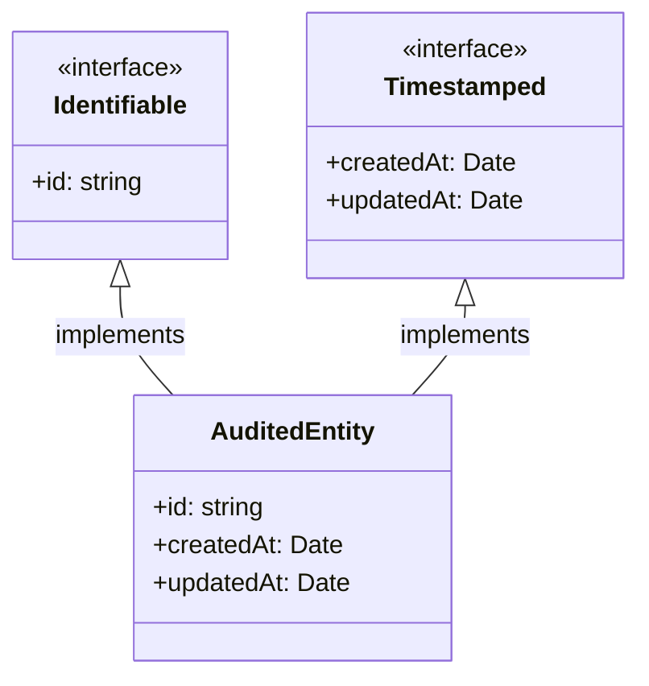

# Intersection types (&)

Un **intersection type** combina varios tipos en **uno más estricto** que **debe cumplir** todos los contratos a la vez.

- `A & B` significa `A` y `B` simultáneamente.
- Útil para **componer capacidades** (mixins, traits), **enriquecer contratos** en fronteras (request + contexto), **marcar/brandear** tipos nominales, y **refinar** datos validados.

:::success

**Regla práctica:** usa `&` para añadir responsabilidades a un tipo sin herencia (composición > herencia).

:::

## Ejemplos fundamentales

1. **Composición de capacidades (traits):** En lugar de crear una gran interfaz con michas responsabilidades, se definen **tipos pequeños y especializados** que representan capacidades individuales. Luego, se **combinan** para formar entidades más completas. Esto promueve la modularidad y la reutilización.

   ```ts showLineNumbers
   type Identifiable = { id: string };
   type Timestamped = { createdAt: Date; updatedAt: Date };

   type AuditedEntity = Identifiable & Timestamped;

   const order: AuditedEntity = {
     id: "o_1",
     createdAt: new Date(),
     updatedAt: new Date(),
   };
   ```

2. **Extender contratos en fronteras (HTTP/infra):** En Clean Architecture, las fronteras (como controladores HTTP, adaptadores CLI, etc) reciben datos del mundo exterior. Para procesarlos correctamente, muchas veces necesitamos **enriquecer esos datos** con contexto adicional (como autenticación, trazabilidad, etc).

   ```ts showLineNumbers
   type HttpRequest = { url: string; headers: Record<string, string> };
   type AuthContext = { userId: string; roles: string[] };

   type AuthedRequest = HttpRequest & AuthContext;

   function handle(req: AuthedRequest) {
     // tiene url, headers, userId, roles
   }
   ```

3. **Branding nominal (evitar mezclar strings):** TypeScript usa un sistema de tipos estructural, lo que significa que dos tipos son compatibles si tienen la misma forma. Esto puede ser peligroso cuando usamos `string` para representar cosas distintas como `UserId`, `OrderId`, `SessionToken`, etc. Aunque todas son cadenas, **semánticamente no deberían mezclarse**. El branding nominal introduce una marca oculta en el tipo para que el compilador los trate como **tipos distintos**, aunque tengan la misma estructura.

   ```ts showLineNumbers
   type Brand<T, K extends string> = T & { readonly __brand: K };

   type UserId = Brand<string, "UserId">;
   type OrderId = Brand<string, "OrderId">;

   const uid = "u_1" as UserId;
   // const bad: UserId = "o_1" as OrderId; // ❌ Brands Incompatibles
   ```

4. **Refinamiento tras validación (type guards):** Cuando recibimos datos de fuentes externas (como HTTP, CLI, archivos, etc), el tipo suele ser `unknown` o muy genérico. Para trabajar con seguridad, necesitamos **validar** que esos datos cumplen ciertas estructuras, y luego **refinar su tipo** para que el compilador nos permita operar con ellos sin perder seguridad. Los type guards son funciones que hacen exactamente eso: verifican una condición y, si se cumple, **informan al compilador** que el valor tiene un tipo más específico.

   ```ts showLineNumbers
   type WithId = { id: string };
   type WithName = { name: string };

   function hasId(x: unknown): x is WithId {
     return !!x && typeof (x as any).id === "string";
   }
   function hasName(x: unknown): x is WithName {
     return !!x && typeof (x as any).name === "string";
   }

   function toUser(x: unknown): WithId & WithName {
     if (hasId(x) && hasName(x)) return x;      // Ahora se tipa como intersección
     throw new Error("Invalid user");
   }
   ```

5. **Funciones: intersección como "sobrecarga" compatible:** Cuando usamos `FnA & FnB`, estamos diciendo que la función debe **cumplir ambas firmas**: debe aceptar un `number` como entrada y un string como entrada, y en ambos casos devolver un string. Esto no es lo mismo que una unión (`FnA | FnB`), que implicaría que la función cumple **una u otra** firma. La intersección exige que la función sea **compatible con ambas**.

   ```ts showLineNumbers
   type FnA = (x: number) => string;
   type FnB = (x: string) => string;

   type Fn = FnA & FnB; // debe aceptar number AND string

   const fn: Fn = (x: number | string) => String(x).toUpperCase();
   ```

   Una variable de tipo `FnA & FnB` debe poder manejar ambas firmas.

## Matices y "gotchas"

- **Conflictos de propiedades:**

  Si el mismo campo tiene **tipos incompatibles**, la intersección colapsa (efectivamente **inusable**).

  ```ts showLineNumbers
  type A = { x: string };
  type B = { x: number };
  type C = A & B; // { x: never } → imposible de instanciar en la práctica
  ```

- **Intersección con uniones y precedencia:**

  - `&` tiene mayor precedencia que `|`: `A | B & C` es igual a `A | (B & C)`
  - Distribución: `(A | B) & C` puede ser visto como `(A & C) | (B & C)`

  ```ts showLineNumbers
  type Base = { id: string };
  type Admin = { role: "admin"; perms: string[] };
  type User  = { role: "user" };

  type X = Base | Admin & Base; // Es igual a Base | (Admin & Base) pero es diferente a (Base | Admin) & Base
  ```

- **Opción vs suma de capacidades:**

  - Opcional: `{a?: string}` (mismo chape con campo opcional).
  - Intersección: `TypeA & TypeB` (unión de miembros, más estricto)

## Patrones profesionales

- **Mixins con funciones (composición a partir de objetos):** Un mixin es una técnica de composición que permite extender objetos con nuevas capacidades sin necesidad de herencia. En lugar de crear jerarquías de clases, se combinan comportamientos mediante funciones que agregan propiedades o métodos a un objeto existente.

  ```ts showLineNumbers
  type WithSoftDelete = { deletedAt?: Date; delete(): void };
  type WithTenant = { tenantId: string };

  function makeSoftDeletable<T extends object>(o: T): T & WithSoftDelete {
    return Object.assign(o, {
      delete() { (o as any).deletedAt = new Date(); }
    });
  }

  const entity = makeSoftDeletable({ id: "1", tenantId: "t1" }) as
    { id: string; tenantId: string } & WithSoftDelete;

  entity.delete();
  ```

- **Composición de DTOs con utilitarios:** Un DTO (Data Transfer Object) es una estructura que representa datos que se envían o reciben entre capas de una aplicación. Su propósito es transportar información de forma clara, tipada y controlada, sin incluir lógica de negocio.

  ```ts showLineNumbers
  type BaseDTO = Readonly<{ id: string; createdAt: string }>;
  type Updatable = Partial<{ name: string; email: string }>;

  type UpdateUserDTO = BaseDTO & Updatable;
  ```

  Suma requisitos estables (`BaseDTO`) con campos editables (`Partial<>`)

- **"Result" enriquecido con metadatos:** El patrón "Result" es una forma funcional de representar el resultado de una operación que puede:

  - Tener éxito (`OK<T>`)
  - Fallar (`Fail<E>`)
  
  Este enfoque evita el uso de excepciones y promueve un manejo explícito de errores.

  ```ts showLineNumbers
  type Ok<T>   = { kind: "ok"; value: T };
  type Fail<E> = { kind: "error"; error: E };

  type WithMeta = { requestId: string; ts: number };

  type RichResult<T, E = Error> = (Ok<T> | Fail<E>) & WithMeta;

  const r: RichResult<number> = {
    kind: "ok", value: 42, requestId: "req-1", ts: Date.now()
  };
  ```

- **Endurecer opcionales mediante `&`:** En TypeScript, una propiedad marcada como opcional (`email?: string`) puede estar presente o no. Sin embargo, en ciertos contextos, (por ejemplo, validación, persistencia o actualización), podrías necesitar garantizar que esa propiedad está presente. La técnica consiste en componer el tipo original con otro que exige la propiedad, convirtiéndola en obligatoria.

  ```ts showLineNumbers
  type UserBase = { id: string; email?: string };
  type RequireEmail = { email: string };

  type UserWithEmail = UserBase & RequireEmail; // email pasa a ser requerido
  ```

- **Reutilizar invariantes en casos de uso (Clean Architecture):** En el contexto de Clean Architecture, los invariantes son propiedades o reglas que se mantienen constantes en todas las entidades del dominio. Son fundamentales para garantizar consistencia, trazabilidad y control de versiones en los modelos de negocio.
  
  ```ts showLineNumbers
  // domain/contracts
  export type Identified = { id: string };
  export type Versioned  = { version: number };

  export type AggregateRoot = Identified & Versioned;

  // application/usecases
  export interface Order extends AggregateRoot {
    total: number;
    status: "PENDING" | "PAID";
  }
  ```

## Composición por intersección



En concepto, `AuditedEntity` cumple ambos contratos (`Identifiable` y `Timestamped`)

## Referencias

- Microsoft. (s.f.). [TypeScript Handbook: Unions and Intersections](https://www.typescriptlang.org/docs/).
- Vanderkam, D. (2019). Effective TypeScript: 62 Specific Ways to Improve Your TypeScript. O’Reilly Media.
- Flanagan, D. (2020). JavaScript: The Definitive Guide (7.ª ed.). O’Reilly Media.
- Zakas, N. C. (2012). Maintainable JavaScript: Writing Readable Code. O’Reilly Media.
- Google. (s.f.). [JavaScript Style Guide](https://google.github.io/styleguide/jsguide.html).
