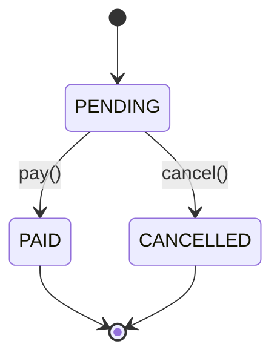

# Tipos literales y enums

Los **tipos literales** restringen un valor a **una constante exacta** (p. ej., `'PAID'`, `200`, `true`) o a una unión finita de constantes. Son ideales para estados de dominio, roles, métodos HTTP, etc.

Por otro lado, los **enum** construyen un tipo y un objeto en tiempo de ejecución con miembros nombrados. Útil cuando necesitas valores en runtime y nombres canónicos.

Ten presente esta regla: usa **uniones de literales** por defecto para *tipos cerrados*; usa **enum** cuando **necesites objeto runtime** o interoperar con código JS que espera ese objeto (p. ej., tablas de mapeo, switch con nombres, logging formal).

## Tipos literales (string, number, boolean)

- **Unión de literales (dominios finitos):** En TypeScript, la unión de literales permite restringir un tipo a un conjunto específico de valores. Es una forma poderosa de representar dominios cerrados, como estados, roles, categorías o comandos.

  ```ts showLineNumbers
  /** Estado de dominio modelado con union de string literales */
  export type OrderStatus = 'PENDING' | 'PAID' | 'CANCELLED';

  export function canShip(status: OrderStatus): boolean {
    return status === 'PAID';
  }

  // Verificación exhaustiva (excelente para refactorización)
  export function nextStatus(current: OrderStatus): OrderStatus {
    switch (current) {
      case 'PENDING': return 'PAID';
      case 'PAID': return 'PAID';      // ejemplo idempotente
      case 'CANCELLED': return 'CANCELLED';
      default: {
        const _exhaustive: never = current;
        return _exhaustive;
      }
    }
  }
  ```

- **Literal numérico/booleano:** Los tipos literales también pueden ser aplicados con valores numéricos y booleans.

  ```ts showLineNumbers
  type HttpOk = 200;
  type FeatureOn = true;

  const ok: HttpOk = 200;
  const on: FeatureOn = true;
  ```

## Congelación de tipos y derivación segura de tipos

`as const` “congela” literales para preservar su valor exacto en lugar de ampliarlos a tipos más generales (`string`, `number`, etc.). Esto permite:

- Inferencia precisa de tipos.
- Seguridad en el acceso a propiedades.
- Derivación automática de tipos sin duplicar información.

La **derivación segura de tipos** es una técnica que permite extraer tipos directamente desde valores o estructuras existentes, de esta forma se logra que el tipo siempre esté sincronizado con los datos.

```ts showLineNumbers
// Source of truth as data + types derived from it
export const STATUSES = ['PENDING', 'PAID', 'CANCELLED'] as const;
export type OrderStatus = typeof STATUSES[number]; // 'PENDING' | 'PAID' | 'CANCELLED'

// Object map + keyof typeof
export const Methods = {
  GET:  'GET',
  POST: 'POST',
  PUT:  'PUT',
  DELETE: 'DELETE',
} as const;

export type HttpMethod = keyof typeof Methods;     // 'GET'|'POST'|'PUT'|'DELETE'
export type HttpMethodValue = typeof Methods[HttpMethod]; // same union of values
```

**Ventaja:** una única fuente (Array u objeto) alimenta tipos y valores, evitando desalineación entre dominio y tipado.

## Template literal types (potenciación de literales)

Los templates literales permiten construir **tipos de cadenas a partir de patrones:**

```ts showLineNumbers
type Entity = 'order' | 'invoice';
type Action = 'created' | 'paid' | 'cancelled';

/** Nombre de evento similar a "order:created" | "invoice:paid" */
export type EventName = `${Entity}:${Action}`;

const e1: EventName = 'order:created';   // ✅
const e2: EventName = 'order:deleted';   // ❌ no se encuentra en Action
```

También es útil para identificadores con prefijos o rutas:

```ts showLineNumbers
type Id<T extends string> = `${T}_${string}`;
type OrderId = Id<'ord'>;     // "ord_<algo>"
const id: OrderId = 'ord_123';
```

## `enum`: numérico y de cadena

- **Numérico:** Cada valor tiene una asignación numérica por default partiendo del 0.
  
  ```ts showLineNumbers
  export enum Role {
    User,    // 0
    Manager, // 1
    Admin,   // 2

  }

  const r: Role = Role.Admin;
  if (r === Role.Admin) { /*...*/ }
  ```

  También se puede aplicar la estrategia **reverse mapping** en JS (`Role[2] == 'Admin'`)

- **De cadena:** Mayormente recomendado, ya que personalizas los valores a asignar en los atributos del enum.

  ```ts showLineNumbers
  export enum PaymentKind {
    Card = 'card',
    Cash = 'cash',
    Transfer = 'transfer',
  }
  ```

  Es más legible en logs/JSON, y sin **reverse mapping** para evitar confusiones.

- **`const enum` (compila a inlines):** Es un poco menos común por el cuidado con el que se debe usar: No es recomendado para librerías no con `isolatedModules`

  ```ts showLineNumbers
  const enum Flag { On = 1, Off = 0 }
  const state = Flag.On; // el compilador sustituye por 1
  ```

## ¿Cómo elegir?

Cuándo preferir enum:

- Necesitas **objeto en runtime** (iterar, mapear, imprimir nombres).
- Quieres **nombrar miembros** con una API canónica (`Role.Admin`).

Cuándo preferir uniones de literales:

- No necesitas objeto runtime; solo **tipo** y **seguridad**.
- Buscas **exhaustividad** y facilidad de refactor (añadir una variante rompe donde falte manejarla).

|Aspecto|Unión de literales|`enum` cadena|`enum` numérico|
|--|--|--|--|
|Chequeo exhaustivo `switch`|Excelente|Bueno|Bueno|
|Objeto en runtime|No (a menos que crees uno con `as const`)|Sí|Sí (+ reverse mapping)|
|Serialización/Logs legibles|Si (valores string)|Si|Requiere mapear número→nombre|
|DX (refactor: añadir variante)|Compilador guía|Compilador guía|Compilador guía|
|Recomendación general|**Primera opción**|Úsalo si necesitas objeto|Casos específicos/legacy|

## Ejemplo técnico

**Dominio:** estados del pedido con uniones de literales.
**Aplicación:** usa casos de uso tipados.
**Interfaces/HTTP:** mapea a DTOs y valida.

import Tabs from "@theme/Tabs";
import TabItem from "@theme/TabItem";

<Tabs>
<TabItem value="domain" label="Dominio">

```ts showLineNumbers title="domain/entities/Order.ts"
export type OrderStatus = 'PENDING' | 'PAID' | 'CANCELLED';

export interface Order {
  id: string;
  total: number;
  status: OrderStatus;
}
```

</TabItem>
<TabItem value="application" label="Aplicación">

```ts showLineNumbers title="application/usecases/PayOrder.ts"
export class PayOrder {
  constructor(private readonly repo: { findById(id: string): Promise<Order|null>; save(o: Order): Promise<void> }) {}

  /** Tipos explícitos hacía los margenes */
  async execute(orderId: string): Promise<Order> {
    const order = await this.repo.findById(orderId);

    if (!order) throw new Error('Order not found');
    if (order.status !== 'PENDING') throw new Error('Invalid state');

    const updated: Order = { ...order, status: 'PAID' };
    await this.repo.save(updated);

    return updated;
  }
}
```

</TabItem>
<TabItem value="interface" label="Interfaz">

```ts showLineNumbers title="interfaces/http/OrderController.ts"
import type { Request, Response } from 'express';

export async function payOrderHandler(req: Request, res: Response) {
  try {
    const { id } = req.params as { id: string };
    const order = await useCases.payOrder.execute(id);
    // El tipo tipo status asegura solo 'PENDING'|'PAID'|'CANCELLED'
    return res.status(200).json(order);
  } catch (e) {
    return res.status(400).json({ error: (e as Error).message });
  }
}
```

</TabItem>
</Tabs>



## Patrón híbrido: objeto `as const` + tipo derivado

Consigue los mejor de ambos mundos: valores runtime + tipos estrictos sin `enum`.

```ts showLineNumbers
// Una sola fuente de verdad (runtime + type)
export const Role = {
  User:   'user',
  Admin:  'admin',
  Auditor:'auditor',
} as const;

export type Role = typeof Role[keyof typeof Role]; // 'user'|'admin'|'auditor'

// Uso en objeto runtime:
function canViewAudit(role: Role): boolean {
  return role === Role.Admin || role === Role.Auditor;
}
```

## Referencias

- Microsoft. (s.f.). [TypeScript Handbook: Literal Types, Enums, Template Literal Types](https://www.typescriptlang.org/docs/).
- Vanderkam, D. (2019). Effective TypeScript: 62 Specific Ways to Improve Your TypeScript. O’Reilly Media.
- Flanagan, D. (2020). JavaScript: The Definitive Guide (7.ª ed.). O’Reilly Media.
- Mozilla Developer Network. (s.f.). [Enumerations and Constants in JS/TS (Patterns)](https://developer.mozilla.org/).
- Google. (s.f.). [JavaScript Style Guide](https://google.github.io/styleguide/jsguide.html).
