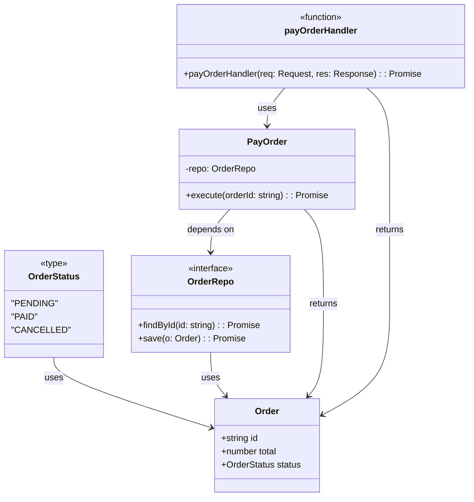
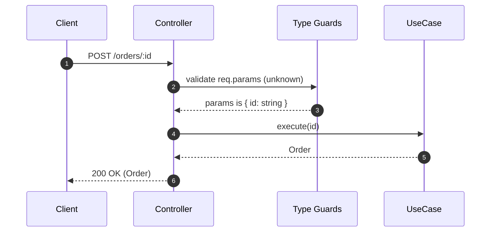

# Narrowing y type guards

**Narrowing** (refinamiento) es el proceso por el cual TypeScript **reduce** un tipo amplio (por ejemplo, una unión) a un tipo más específico basándose en **comprobaciones de tiempo de ejecución**: `typeof`, `instanceof`, checks de igualdad, verificación de propiedades (`in`), análisis de verdad (truthiness), y **type guards** definidos por el usuario.

**Meta:** evitar `as` y `any`. En su lugar, **demuestra** al compilador qué tipo es realmente en cada rama de control.

## Técnicas de narrowing integradas

1. `typeof` (primitivos):

   ```ts showLineNumbers
   function formatId(id: string | number) {
     return typeof id === "number" ? `#${id}` : id.toUpperCase();
   }
   ```

2. `instanceof` (clases/constructores)

   ```ts showLineNumbers
   function toIso(x: Date | string) {
     return x instanceof Date ? x.toISOString() : new Date(x).toISOString();
   }
   ```

3. `in` (propiedad en objeto)

   ```ts showLineNumbers
   type Dog = { kind: "dog"; bark: () => void };
   type Cat = { kind: "cat"; meow: () => void };

   function speak(pet: Dog | Cat) {
     if ("bark" in pet) pet.bark(); else pet.meow();
   }
   ```

4. Truthiness / nullish

   ```ts showLineNumbers
   function display(title?: string | null) {
     return title ?? "(no title)"; // respeta "" como válido
   }
   ```

5. Igualdad estricta y discriminantes

   ```ts showLineNumbers
   type Payment =
     | { kind: "card"; last4: string }
     | { kind: "cash"; change: number };

   function render(p: Payment) {
     if (p.kind === "card") return `Card •••• ${p.last4}`;
     return `Cash (change: ${p.change})`;
   }
   ```

## Type Guards definidos por el usuario

Un **type guard** es una función cuyo retorno es un **predicado de tipo** (`x is T`). Permite a TS refinar el tipo fuera de la función.

```ts showLineNumbers
type User = { id: string; name: string };

function isUser(x: unknown): x is User {
  return !!x
    && typeof x === "object"
    && typeof (x as any).id === "string"
    && typeof (x as any).name === "string";
}

function greet(x: unknown) {
  if (isUser(x)) {
    // x es User aquí
    return `Hello, ${x.name}`;
  }
  return "Hello, guest";
}
```

### Guard genérico para propiedades

```ts showLineNumbers
function hasProp<K extends PropertyKey>(
  obj: unknown, key: K
): obj is Record<K, unknown> {
  return !!obj && typeof obj === "object" && key in (obj as object);
}

function pickId(x: unknown) {
  if (hasProp(x, "id") && typeof x.id === "string") return x.id;
  throw new Error("Missing string id");
}
```

## Assertion functions (con y sin predicado)

- `asserts condition`: Si no se cumple, lanza; si se cumple, el flujo continúa.
- `asserts x is T`: además, refina el tipo de `x`

```ts showLineNumbers
/** Throws si la condición es falsy. */
function assert(condition: unknown, msg = "Assertion failed"): asserts condition {
  if (!condition) throw new Error(msg);
}

/** Validador Runtime que rei que se limita el éxito. */
function assertIsOrder(x: unknown): asserts x is { id: string; total: number } {
  assert(!!x && typeof x === "object", "Not an object");
  assert(typeof (x as any).id === "string", "id must be string");
  assert(typeof (x as any).total === "number", "total must be number");
}

async function handle(input: unknown) {
  assertIsOrder(input);   // a partir de aquí, input es {id:string; total:number}
  return `Order ${input.id} total=${input.total}`;
}
```

## Ejemplo Técnico: Narrowing en controladores (Clean Architecture, sin `any`)

**Contexto:** endpoint Express que recibe JSON desconocido, valida y delega al caso de uso.

import Tabs from '@theme/Tabs';
import TabItem from '@theme/TabItem';

<Tabs>
<TabItem value="diagram" label="Diagrama de Clases">



</TabItem>
<TabItem value="domain" label="Dominio">

```ts showLineNumbers title="domain/entities/Order.ts"
export type OrderStatus = "PENDING" | "PAID" | "CANCELLED";
export interface Order { id: string; total: number; status: OrderStatus }
```

</TabItem>
<TabItem value="application" label="Aplicación">

```ts showLineNumbers title="application/usecases/PayOrder.ts"
export interface OrderRepo {
  findById(id: string): Promise<Order | null>;
  save(o: Order): Promise<void>;
}

export class PayOrder {
  constructor(private readonly repo: OrderRepo) {}

  async execute(orderId: string): Promise<Order> {
    const o = await this.repo.findById(orderId);
    if (!o) throw new Error("Order not found");
    if (o.status !== "PENDING") throw new Error("Invalid state");
    const updated: Order = { ...o, status: "PAID" };
    await this.repo.save(updated);
    return updated;
  }
}
```

</TabItem>
<TabItem value="interface" label="Interface">

```ts showLineNumbers title="interface/http/guards.ts"
import type { Request, Response } from "express";

function isIdParams(x: unknown): x is { id: string } {
  return !!x && typeof (x as any).id === "string";
}

export async function payOrderHandler(req: Request, res: Response) {
  try {
    if (!isIdParams(req.params)) {
      return res.status(400).json({ error: "Missing id param" });
    }
    const order = await useCases.payOrder.execute(req.params.id);
    return res.status(200).json(order);
  } catch (e) {
    const msg = e instanceof Error ? e.message : "Unknown error";
    return res.status(400).json({ error: msg });
  }
}
```

Observaciones:

- **Borde de la app** (`req.params`) tratado como `unknown` y refinado con guards.
- En `catch`, **narrowing del error**: `e instanceof Error` (desde TS 4.4 `catch` es `unknown` por defecto).

</TabItem>
</Tabs>

## Exhaustividad con `never` (seguridad en refactors)

La **exhaustividad con `never`** es una técnica en TS que permite garantizar que **todas las variantes de un tipo discriminado** estén siendo correctamente manejadas en tu código. Es muy útil cuando se trabaja con uniones de tipos, y necesitas que el compilador te avise si olvidas cubrir algún caso, por ejemplo, al hacer un `switch`.

```ts showLineNumbers
type Result =
  | { kind: "ok"; value: number }
  | { kind: "err"; message: string };

function handle(res: Result) {
  switch (res.kind) {
    case "ok":  return res.value;
    case "err": return res.message;
    default: {
      const _exhaustive: never = res; // si aparece nueva variante, el compilador falla
      return _exhaustive;
    }
  }
}
```

## `satisfies` para validar tablas y mantener literales

El operador `satisfies` verifica que un valor cumpla con un tipo, pero sin forzar el valor de adoptar ese tipo.

```ts showLineNumbers
const STATUS_LABELS = {
  PENDING: "Pending",
  PAID: "Paid",
  CANCELLED: "Cancelled",
} as const satisfies Record<"PENDING" | "PAID" | "CANCELLED", string>;
```

Beneficios:

- Garantiza que el objeto cumpla el contrato sin ensanchar sus literales.
- Evita errores silenciosos al modificar claves.
- Preserva los literales para usar en validaciones, comparaciones o tipado estricto.
- Ideal para CLI, enums, mapeos de estados, etc.
- Compatible con Clean Architecture, donde los contratos deben ser explícitos y seguros.

## Validación en la frontera HTTP



## Principios recomendados

- **Clean Code:** evita `any`/`as`; usa guards claros y reusables; nombra los discriminantes (`kind`, `type`) y funciones (`isUser`, `assertIsOrder`).
- **SRP (S):** cada guard **valida una cosa**; assert separa validación de negocio de transporte.
- **OCP (O):** **uniones discriminadas** + `never` fuerzan exhaustividad al añadir variantes.
- **DIP (D):** los casos de uso dependen de **contratos**; los guards viven en la capa de **interfaces**, cerca de la frontera.
- **Clean Architecture:** **dominio sin `any`**; **interfaces** refinan `unknown` → tipos del dominio antes de orquestar.

## Referencias

- Microsoft. (s.f.). [TypeScript Handbook: Narrowing, Type Guards, Assertion Functions](https://www.typescriptlang.org/docs/).
- Vanderkam, D. (2019). Effective TypeScript: 62 Specific Ways to Improve Your TypeScript. O’Reilly Media.
- Flanagan, D. (2020). JavaScript: The Definitive Guide (7.ª ed.). O’Reilly Media.
- Mozilla Developer Network. (s.f.). [typeof, instanceof, and property checks](https://developer.mozilla.org/).
- Zakas, N. C. (2012). Maintainable JavaScript: Writing Readable Code. O’Reilly Media.
