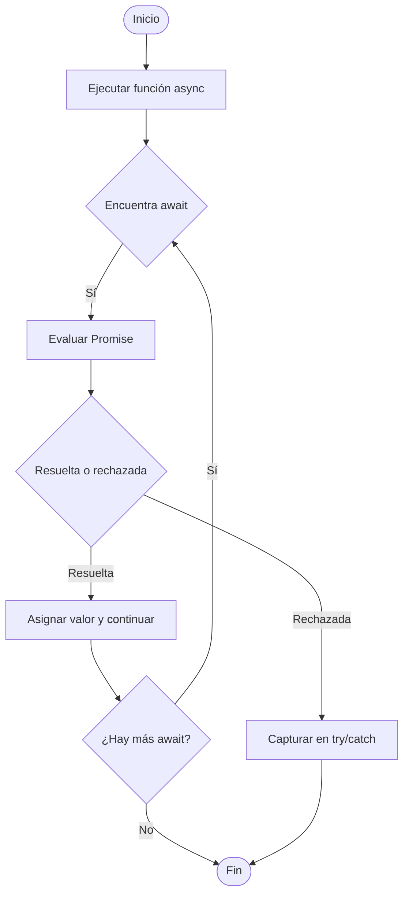

# async/await y control de errores

`async`/`await` es **azúcar sintáctico** (syntactic sugar) introducido en **ES2017** que facilita trabajar con Promises:

- `async` indica que una función devuelve siempre una Promise.
- `await` detiene la ejecución de la función `async` hasta que la Promise se resuelva o rechace.

La gran ventaja es que permite escribir código asincrónico con un flujo más lineal y legible.

## Ejemplo parcial

Veamos el mismo código, pero en 2 versiones:

import Tabs from "@theme/Tabs";
import TabItem from "@theme/TabItem";

<Tabs>
<TabItem value="promises" label="Promesas">

```ts showLineNumbers
function getUser() {
  return fetch('/user').then(res => res.json());
}

getUser()
  .then(user => console.log(user))
  .catch(error => console.error(error));
```

</TabItem>
<TabItem value="async-await" label="async/await">

```ts showLineNumbers
async function getUser() {
  try {
    const res = await fetch('/user');
    const user = await res.json();
    console.log(user);
  } catch (error) {
    console.error(error);
  }
}
```

</TabItem>
</Tabs>

## Características clave

1. Una función `async` devuelve siempre una Promise.

   ```ts
   async function foo() {
     return 42; // Esto devuelve Promise.resolve(42)
   }
   ```

2. `await` solo puede usarse dentro de funciones async (o en el tope de un módulo ES en entornos modernos).
3. `await` pausa la función hasta que la Promise se resuelva o se rechace.

## Flujo async/await y control de errores



## Control de errores

Con Promises, usamos `.catch()`, pero con `async`/`await`, usamos `try/catch`:

```ts showLineNumbers
async function processData() {
  try {
    const user = await fetchUser();
    const orders = await fetchOrders(user.id);
    console.log(orders);
  } catch (error) {
    console.error('Error en el flujo:', error);
  }
}
```

Al igual que en Promises, podemos usar `finally` para ejecutar algo siempre, haya o no error:

```ts showLineNumbers
async function runTask() {
  try {
    await task();
  } catch (error) {
    console.error(error);
  } finally {
    console.log('Siempre se ejecuta');
  }
}
```

## Ventajas

1. Código más limpio y legible.
2. Fácil de combinar con estructuras de control (`if`, `for`, `switch`).
3. Permite manejar errores con `try/catch` de forma clara.
4. Facilita la escritura de flujos asincrónicos complejos.

## Buenas prácticas

1. Encadenar promesas en paralelo cuando no dependen entre si:

   ```ts showLineNumbers
   // Evita esto:
   const user = await fetchUser();
   const orders = await fetchOrders(user.id); // OK, depende de user
   const settings = await fetchSettings();    // ❌ no depende, pero bloquea

   // Mejor:
   const user = await fetchUser();
   const [orders, settings] = await Promise.all([
     fetchOrders(user.id),
     fetchSettings()
   ]);
   ```

2. Siempre capturar errores:

   - Usa `try/catch` dentro de funciones `async`.
   - Usa `.catch()` en el lugar donde se llama a la función `async` si no se capturan internamente.

3. No abusar de `await` dentro de bucles. Considera paralelizar con `Promise.all`.

## Ejemplo técnico

```ts showLineNumbers
async function main() {
  try {
    const user = await fetchUser('123');
    const [orders, settings] = await Promise.all([
      fetchOrders(user.id),
      fetchSettings()
    ]);

    console.log('Usuario:', user);
    console.log('Pedidos:', orders);
    console.log('Ajustes:', settings);
  } catch (error) {
    console.error('Algo salió mal:', error);
  } finally {
    console.log('Proceso terminado');
  }
}
```

## Referencias

- Flanagan, D. (2020). JavaScript: The Definitive Guide (7th ed.). O’Reilly Media.
- Mozilla Developer Network. (s.f.). [async function](https://developer.mozilla.org/en-US/docs/Web/JavaScript/Reference/Statements/async_function).
- Mozilla Developer Network. (s.f.). [await](https://developer.mozilla.org/en-US/docs/Web/JavaScript/Reference/Operators/await).
- TypeScript Handbook. (s.f.). [Async/Await](https://www.typescriptlang.org/docs).
- Google. (s.f.). [JavaScript Style Guide](https://google.github.io/styleguide/jsguide.html).
