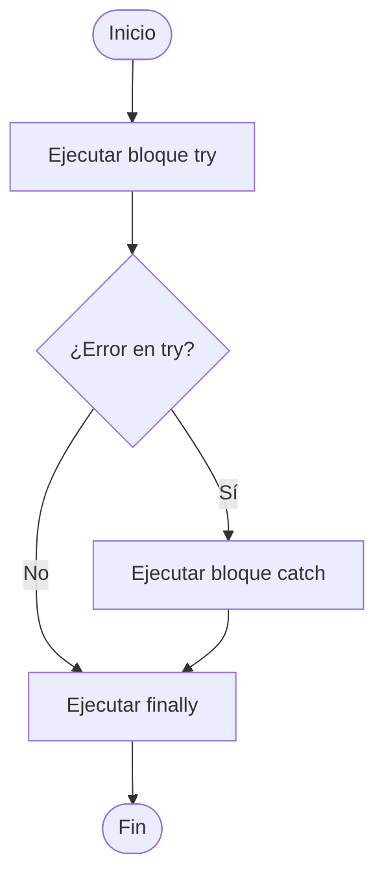

# Manejo avanzado de errores con try/catch

El manejo de errores es fundamental para garantizar:

- La **estabilidad** de la aplicación
- Una **experiencia de usuario** fluida
- La posibilidad de hacer **debugging efectivo**
- La **prevención de caídas** no controladas del sistema

En proyectos empresariales, un buen manejo de errores puede evitar pérdidas de datos, fugas de seguridad y fallos de servicio.

## Sintaxis básica

```ts showLineNumbers
try {
  // Código que podría lanzar un error
} catch (error) {
  // Código para manejar el error
}
```

Por ejemplo:

```ts showLineNumbers
try {
  const data = JSON.parse('{ nombre: "Carlos" '); // JSON mal formado
} catch (error) {
  console.error('Error al parsear JSON:', error.message);
}
```

Adicional, se puede trabajar con `finally`, el cual se ejecuta haya o no error, ideal para cerrar conexiones, limpiar recursos, ocultar loaders, etc.

```ts showLineNumbers
try {
  // Código riesgoso
} catch (error) {
  // Manejador de errores
} finally {
  // Siempre se ejecuta
}
```

Por ejemplo:

```ts showLineNumbers
try {
  const result = await doSomething();
  console.log('Resultado:', result);
} catch (err) {
  console.error('Falló:', err);
// highlight-next-line
} finally {
  console.log('Proceso finalizado');
}
```

## Captura tipada de errores en TypeScript

TS permite tipar errores para mayor control:

```ts showLineNumbers
try {
  // ...
} catch (error: unknown) {
  // highlight-next-line
  if (error instanceof Error) {
    console.error(error.message);
  }
}
```

En este caso, usar `unknown` obliga a verificar el tipo antes de usar propiedades como `message`.

## Manejo de errores en funciones `async`

Es una buena práctica **registrar el error y relanzarlo**, para que la función que llama pueda manejarlo.

```ts showLineNumbers
async function fetchUser(id: number) {
  try {
    const res = await fetch(`/api/users/${id}`);
    if (!res.ok) throw new Error('Usuario no encontrado');
    return await res.json();
  } catch (error) {
    console.error('Fallo al obtener usuario:', error);
    //highlight-next-line
    throw error; // Repropaga el error
  }
}
```

## Personalización de errores

Puedes crear tus propias clases de error para mayor control semántico:

```ts showLineNumbers
class ValidationError extends Error {
  constructor(message: string) {
    super(message);
    this.name = 'ValidationError';
  }
}
```

```ts showLineNumbers
try {
  throw new ValidationError('Campo "email" es obligatorio');
} catch (error) {
    // highlight-next-line
  if (error instanceof ValidationError) {
    console.warn('Error de validación:', error.message);
  } else {
    console.error('Otro tipo de error:', error);
  }
}
```

## Flujo de ejecución



## Casos reales de uso

1. **API RESTful:** Manejar errores de red, tiempo de espera o respuestas inesperadas.
2. **Validación de formularios:** Capturar errores de validación del lado cliente.
3. **Lectura de archivos:** Capturar errores de lectura/escritura.
4. **Lógica de negocio crítica:** Evitar la propagación de errores que puedan afectar flujos posteriores.

## Buenas prácticas

|Práctica|Recomendado|Evitar|
|--|--|--|
|Capturar errores conocidos|✅||
|Repropagar errores si no puedes manejarlos|✅||
|Usar clases personalizadas para errores|✅||
|Abusar de try/catch para lógica normal||❌|
|Silenciar errores sin loguearlos||❌|
|Asumir que `catch(error)` siempre tiene `.message`||❌|

## Referencias

- Flanagan, D. (2020). JavaScript: The Definitive Guide (7th ed.). O’Reilly Media.
- Mozilla Developer Network. (s.f.). [try...catch](https://developer.mozilla.org/en-US/docs/Web/JavaScript/Reference/Statements/try...catch).
- TypeScript Handbook. (s.f.). [Error Handling](https://www.typescriptlang.org/docs/).
- Google. (s.f.). JavaScript [Style Guide](https://google.github.io/styleguide/jsguide.html).
- Crockford, D. (2008). JavaScript: The Good Parts. O'Reilly Media.
