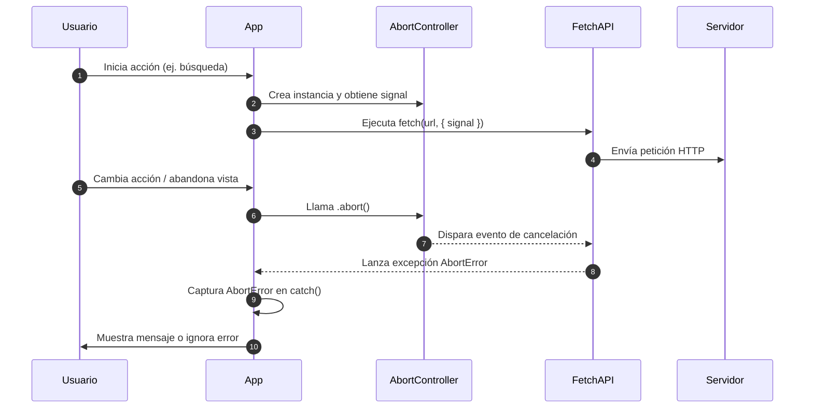

# Cancelación de peticiones y AbortController

`AbortController` es una interfaz del navegador que permite **cancelar peticiones Fetch** antes de que se completen, mediante una señal `AbortSignal`. Es ideal cuando necesitas cancelar peticiones por timeout, navegación, cierre de sesión, búsqueda dinámica, etc.

## Estructura básica

Para hacer uso de la cancelación de peticiones se debe:

1. Crear una instancia de `AbortController`.
2. Acceder a la propiedad `signal` de la instancia y compartirla dentro de las opciones de la petición fetch.
3. En cualquier momento se puede cancelar la petición mediante el controlador.

```ts showLineNumbers
const controller = new AbortController();
const signal = controller.signal;

fetch('/api/data', { signal })
  .then(res => res.json())
  .then(data => console.log(data))
  .catch(error => {
    if (error.name === 'AbortError') {
      console.log('Petición cancelada');
    } else {
      console.error('Otro error:', error);
    }
  });

// En algún momento:
// highlight-next-line
controller.abort(); // Esto cancela la petición
```

También podemos aplicar el concepto dentro de `async`/`await`:

```ts showLineNumbers
async function fetchWithCancel(url: string, controller: AbortController) {
  try {
    const response = await fetch(url, { signal: controller.signal });
    if (!response.ok) throw new Error('Error HTTP');
    return await response.json();
  } catch (err) {
    if ((err as Error).name === 'AbortError') {
      console.warn('La petición fue abortada');
    } else {
      throw err;
    }
  }
}
```

## Ejemplo: Búsqueda en tiempo real

Definimos una función uqe realizará una búsqueda usando los valores ingresados por el usuario:

```ts showLineNumbers
let currentController: AbortController | null = null;

async function search(query: string) {
  if (currentController) {
    currentController.abort(); // Cancela búsqueda anterior
  }

  currentController = new AbortController();

  try {
    const res = await fetch(`/api/search?q=${encodeURIComponent(query)}`, {
      signal: currentController.signal,
    });

    const results = await res.json();
    console.log('Resultados:', results);
  } catch (err) {
    if ((err as Error).name === 'AbortError') {
      console.log('Búsqueda anterior cancelada');
    } else {
      console.error('Error en búsqueda:', err);
    }
  }
}
```

Cada que el usuario ingresa un valor en el input, la función es llamada y cancela la petición anterior si se encuentra activa, y lanza una nueva petición.

```ts showLineNumbers
const input = document.querySelector('#busqueda') as HTMLInputElement;

input.addEventListener('input', () => {
  const query = input.value.trim();
  if (query.length > 2) {
    search(query);
  }
});
```

## Uso de AbortController para cancelar una petición fetch



1. El usuario ejecuta una acción en la plataforma.
2. La app recibe el llamado, crea una instancia de AbortController, y obtiene el signal.
3. A su vez, la app ejecuta un fetch a la URL y le comparte como propiedad el signal creado.
4. La FetchAPI envía una petición HTTP al servidor con la solicitud del usuario.
5. El usuario cambia de acción o abandona la vista en la que se encuentra.
6. El cambio es detectado por la app y llama a `.abort()` para detener la petición.
7. La instancia de AbortController dispara el evento de cancelación.
8. La FetchAPI lanza una excepción por cancelación de la petición.
9. La excepción es atrapada en el bloque `try/catch`.
10. La app toma la decisión de mostrar un error al usuario, o de manejarlo internamente y continuar con la ejecución de la aplicación.

## Integración avanzada

1. Usando timeout manual:

   ```ts showLineNumbers
   function fetchWithTimeout(url: string, timeout = 5000) {
     const controller = new AbortController();

     const timeoutId = setTimeout(() => controller.abort(), timeout);

     return fetch(url, { signal: controller.signal })
       .finally(() => clearTimeout(timeoutId));
   }
   ```

2. Con componentes de UI, por ejemplo en Angular:

   ```ts showLineNumbers
   ngOnDestroy(): void {
     this.controller.abort(); // Evita memory leaks si el usuario abandona el componente
   }
   ```

## Buenas prácticas

|Práctica|Recomendado|Evitar|
|--|--|--|
|Usar `AbortController` para búsquedas dinámicas, navegación, cierre de sesión|✅||
|Revisar siempre el nombre del error (`AbortError`)|✅||
|Llamar `.abort()` sin necesidad real||❌|
|Usar múltiples controladores para múltiples peticiones independientes|✅||
|Compartir `controller.signal` entre distintas peticiones si no deben cancelarse juntas||❌|

## Referencias

- Mozilla Developer Network. (s.f.). [AbortController](https://developer.mozilla.org/en-US/docs/Web/API/AbortController).
- Mozilla Developer Network. (s.f.). [Fetch API](https://developer.mozilla.org/en-US/docs/Web/API/Fetch_API).
- Flanagan, D. (2020). JavaScript: The Definitive Guide (7th ed.). O’Reilly Media.
- Google. (s.f.). [JavaScript Style Guide](https://google.github.io/styleguide/jsguide.html).
- TypeScript Handbook. (s.f.). [Working with APIs](https://www.typescriptlang.org/docs/).
