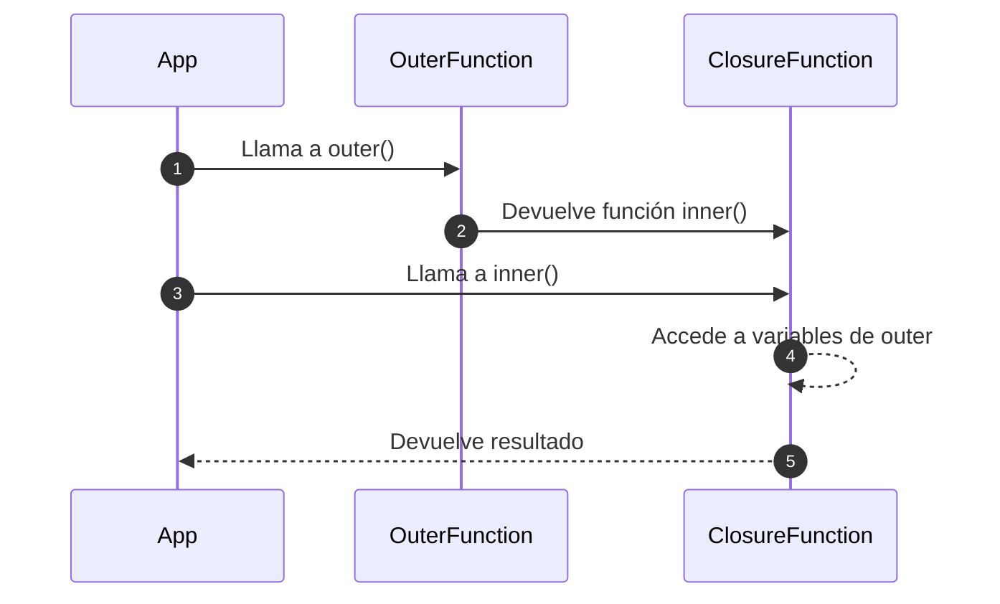
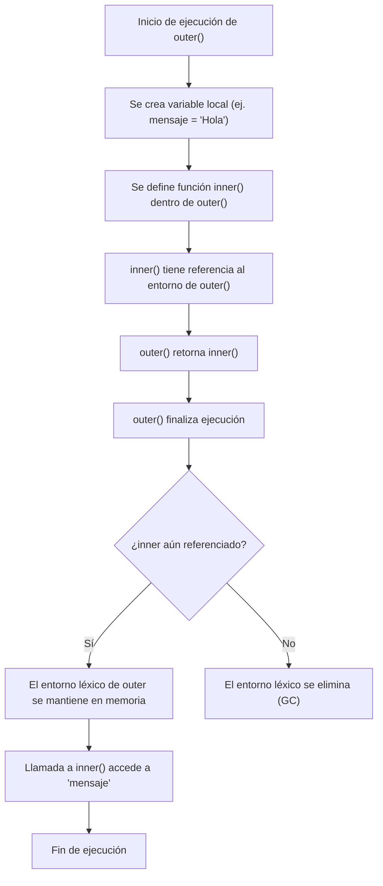

# Closures: definición y usos prácticos

Un **closure** es una función que **“recuerda” el entorno léxico** en el que fue creada, incluso después de que ese entorno haya dejado de existir.

En otras palabras, una función interna tiene acceso a:

- Sus variables propias
- Las variables de su función padre
- Las variables globales

Esto ocurre porque en JavaScript, **las funciones son objetos de primera clase** y mantienen una referencia viva a su contexto de creación (scope).

## Ejemplo técnico

```ts showLineNumbers
function outer() {
  const outerVar = 'visible';

  return function inner() {
    console.log(outerVar); // 'visible'
  };
}

const closureFn = outer();
closureFn(); // aún puede acceder a outerVar
```

Aquí, `inner()` es un closure que **captura** `outerVar` incluso después de que `outer()` terminó su ejecución.

## Usos prácticos

1. Encapsulamiento y privacidad de datos

   ```ts showLineNumbers
   function counter() {
     let count = 0;
     return {
       increment: () => ++count,
       decrement: () => --count,
       getCount: () => count,
     };
   }

   const c = counter();
   c.increment(); // 1
   c.increment(); // 2
   c.getCount();  // 2
   ```

   La variable `count` no es accesible desde afuera, solo mediante métodos seguros.

2. Funciones parciales - currying

   ```ts showLineNumbers
   function greet(greeting: string) {
     return function (name: string) {
       return `${greeting}, ${name}!`;
     };
   }

   const sayHello = greet('Hola');
   sayHello('David'); // 'Hola, David!'
   ```

   Se guarda el estado `greeting` en un closure y se reutiliza

3. Funciones asíncronas en bucles

   ```ts showLineNumbers
   for (let i = 1; i <= 3; i++) {
     setTimeout(() => {
       console.log(`Contador: ${i}`);
     }, i * 1000);
   }
   // Imprime 1, 2, 3 en segundos consecutivos gracias al cierre sobre `i`
   ```

   Gracias a `let` (y closures), cada función conserva su valor correcto de `i`.

4. Factories de funciones

   ```ts showLineNumbers
   function makeMultiplier(factor: number) {
     return function (x: number) {
       return x * factor;
     };
   }

   const double = makeMultiplier(2);
   const triple = makeMultiplier(3);

   double(5); // 10
   triple(5); // 15
   ```

   Crea funciones personalizadas reutilizando lógica común.

5. Creación de módulos o patrones tipo módulo

   Closures son la base de patrones como el **Módulo Revelado** o **Módulo IIFE**,para mantener código organizados y seguro:

   ```ts showLineNumbers
   const userModule = (() => {
     let username = 'David';
     return {
       getUsername: () => username,
       setUsername: (name: string) => (username = name),
     };
   })();

   userModule.getUsername(); // David
   userModule.setUsername('Ana');
   userModule.getUsername(); // Ana
   ```

   El estado interno (`username`) está protegido dentro del closure.

6. Callbacks con contexto guardado

   ```ts showLineNumbers
   function onClickLogger(buttonId: string) {
     return () => console.log(`Click en ${buttonId}`);
   }

   document.getElementById('btnSave')?.addEventListener('click', onClickLogger('Guardar'));
   ```

   Closures permiten pasar funciones con un estado recordado como callbacks. En el anterior ejemplo, cada botón puede tener su logger personalizado sin compartir estado.

7. Control de acceso por niveles o validaciones

   ```ts showLineNumbers
   function secureAccess(userRole: string) {
     return function (resource: string) {
       if (userRole === 'admin') {
         return `Accediendo a ${resource}`;
       } else {
         return `Acceso denegado a ${resource}`;
       }
     };
   }

   const accessForAdmin = secureAccess('admin');
   const accessForUser = secureAccess('user');

   accessForAdmin('config'); // Accediendo a config
   accessForUser('config');  // Acceso denegado a config
   ```

   Permiten configurar funciones con condiciones internas persistentes.

## Uso de Closure



## Prueba de concepto

```ts showLineNumbers
function createSecret(secret: string) {
  return function reveal() {
    return `El secreto es: ${secret}`;
  };
}

const getSecret = createSecret('JS es poderoso');
getSecret(); // El secreto es: JS es poderoso
```

## ¿Cómo se conserva el entorno léxico en un closure?

```ts showLineNumbers
function outer() {
  const mensaje = 'Hola Closure';

  return function inner() {
    console.log(mensaje); // aún accede a mensaje
  };
}

const fn = outer(); // outer() ya terminó, pero...
fn(); // 'Hola Closure'
```

Aunque `outer()` ya se ejecutó, su **contexto (scope)** no es recolectado por el **garbage collector**, porque la función **inner()** aún lo necesita.



## Referencias

- Flanagan, D. (2020). JavaScript: The Definitive Guide (7th ed.). O’Reilly Media.
- Mozilla Developer Network. (s.f.). [Closures](https://developer.mozilla.org/en-US/docs/Web/JavaScript/Closures).
- Crockford, D. (2008). JavaScript: The Good Parts. O’Reilly Media.
- Google. (s.f.). [JavaScript Style Guide](https://google.github.io/styleguide/jsguide.html).
- Zakas, N. C. (2012). Maintainable JavaScript: Writing Readable Code. O’Reilly Media.
