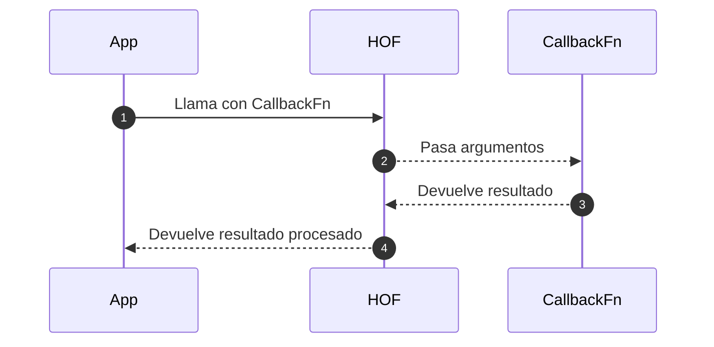

# Funciones de orden superior

Una **función de orden superior** (**HOF**, por sus siglas en inglés) es una función que:

- Recibe una o más funciones como argumentos, (y/o)
- Devuelve una función como resultado

Las HOF permiten escribir código **más reutilizable, expresivo y modular**, reduciendo repeticiones y mejorando la legibilidad.

## Sintaxis general

```ts showLineNumbers
function highOrder(fn: Function): Function {
  return function wrapped(...args: any[]) {
    // lógica adicional
    return fn(...args);
  };
}
```

## Ejemplos técnicos

1. Función que recibe otra función

   ```ts showLineNumbers
   function greet(name: string, formatter: (n: string) => string) {
     return formatter(name);
   }

   const shout = (n: string) => `¡Hola, ${n.toUpperCase()}!`;

   greet('david', shout); // "¡Hola, DAVID!"
   ```

2. Función que devuelve otra función

   ```ts showLineNumbers
   function multiplier(factor: number) {
     return function (x: number) {
       return x * factor;
     };
   }

   const triple = multiplier(3);
   triple(4); // 12
   ```

3. Ambas: recibe y devuelve

   ```ts showLineNumbers
   function logger(fn: Function) {
     return function (...args: any[]) {
       console.log('Args:', args);
       return fn(...args);
     };
   }

   const sum = (a: number, b: number) => a + b;
   const loggedSum = logger(sum);

   loggedSum(2, 3); // Logs: Args: [2, 3] ➝ 5
   ```

## Funciones de orden superior integradas en JS

|Método de array|Descripción|
|---------------|--|
|`map()`|Transforma cada elemento|
|`filter()`|Filtra elementos por condición|
|`reduce()`|Reduce el array a un valor único|
|`forEach()`|Itera sin retorno|
|`some()`|Retorna `true` si al menos uno cumple|
|`every()`|Retorna `true` si todos cumplen|

Por ejemplo con `map` y `filter`:

```ts showLineNumbers
const nums = [1, 2, 3, 4, 5];

const doubled = nums.map(n => n * 2);          // [2, 4, 6, 8, 10]
const evens = nums.filter(n => n % 2 === 0);   // [2, 4]
```

## Uso de función de orden superior



## Aplicaciones prácticas

1. Validación o autorización

   ```ts showLineNumbers
   function withAuth(fn: Function) {
     return function (...args: any[]) {
       if (!user.isAuthenticated) throw new Error("No autorizado");
       return fn(...args);
     };
   }
   ```

2. Logging y monitoreo

   ```ts showLineNumbers
   function withLogger(fn: Function) {
     return function (...args: any[]) {
       console.log(`Ejecutando ${fn.name}`);
       return fn(...args);
     };
   }
   ```

3. Decoradores funciones

   ```ts showLineNumbers
   function debounce(fn: Function, delay: number) {
     let timeout: number;
     return (...args: any[]) => {
       clearTimeout(timeout);
       timeout = setTimeout(() => fn(...args), delay);
     };
   }
   ```

## Buenas prácticas

- Usa funciones puras como argumentos.
- Nombra claramente las funciones retornadas.
- Documenta el tipo de callback esperado.
- No uses funciones anidadas sin necesidad.
- No abuses de HOF sin que mejoren la legibilidad o la eficiencia del código.

## Principios aplicados

- **Clean Code:** funciones pequeñas, un solo propósito, nombres significativos.
- **SOLID:**
  - **S:** Separación de responsabilidades entre lógica principal y transformaciones.
  - **O:** Puedes extender funciones sin modificar las originales.
- **Clean Architecture:** puedes usar HOFs para separar capa de lógica (domain) de controladores (application).

## Referencias

- Flanagan, D. (2020). JavaScript: The Definitive Guide (7th ed.). O’Reilly Media.
- Mozilla Developer Network. (s.f.). [Functions](https://developer.mozilla.org/en-US/docs/Web/JavaScript/Guide/Functions).
- Zakas, N. C. (2012). Maintainable JavaScript: Writing Readable Code. O’Reilly Media.
- Freeman, E., & Robson, E. (2014). Head First JavaScript Programming. O’Reilly Media.
- Google. (s.f.). [JavaScript Style Guide](https://google.github.io/styleguide/jsguide.html).
