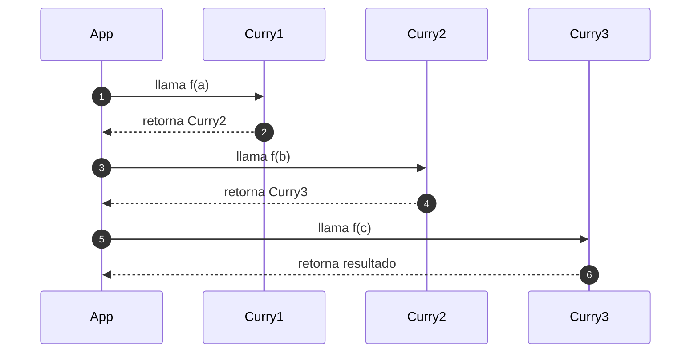

# Currying y composición

## ¿Qué es el Currying?

**Currying** es una técnica funcional que consiste en transformar una función que toma múltiples argumentos en una secuencia de funciones **unarias** (una por argumento), donde cada una **devuelve otra función** hasta que se reciben todos los argumentos necesarios.

En lugar de `f(a, b, c)`, se convierte en `f(a)(b)(c)`

## Ejemplo técnico

```ts showLineNumbers
function currySum(a: number) {
  return function (b: number) {
    return function (c: number) {
      return a + b + c;
    };
  };
}

const result = currySum(2)(3)(4); // 9
```

## Ventajas del currying

- Permite crear funciones parcialmente aplicadas.
- Se adapta bien al principio de composición funcional.
- Favorece la reutilización y especialización de funciones.

## Currying con funciones reutilizables

```ts showLineNumbers
function greet(language: string) {
  return function (name: string) {
    if (language === 'es') return `Hola, ${name}`;
    if (language === 'en') return `Hello, ${name}`;
    return `Hi, ${name}`;
  };
}

const greetInSpanish = greet('es');
greetInSpanish('David'); // "Hola, David"
```

`greet('es')` retorna una función especializada que ya recuerda el idioma.

## Diagrama de secuencia



## ¿Qué es la composición de funciones?

La **composición de funciones** es la técnica de **combinar múltiples funciones pequeñas** en una función más compleja, donde la salida de una función se convierte en la entrada de otra.

Es como una cadena de producción, donde cada función transforma el resultado anterior.

## Sintaxis general

```ts showLineNumbers
const compose = (f: Function, g: Function) => (x: any) => f(g(x));

const toUpper = (s: string) => s.toUpperCase();
const exclaim = (s: string) => s + '!';

const shout = compose(exclaim, toUpper);
shout('hello'); // "HELLO!"
```

## Composición izquierda a derecha (pipe)

```ts showLineNumbers
const pipe = (...fns: Function[]) => (x: any) =>
  fns.reduce((v, f) => f(v), x);

const exclaim = (s: string) => s + '!';

const shoutPipe = pipe(toUpper, exclaim);
shoutPipe('hola'); // "HOLA!"
```

## Principios aplicados

|Principio|Aplicación|
|--|--|
|Clean Code|Pequeñas funciones, responsabilidades claras|
|SOLID (S)|Currying separa responsabilidades por paso|
|DRY|Currying y composición evitan duplicar lógica|
|Clean Architecture|Composición permite separar pipelines de transformación|

## Referencias

- Flanagan, D. (2020). JavaScript: The Definitive Guide (7th ed.). O'Reilly Media.
- Freeman, E., & Robson, E. (2014). Head First JavaScript Programming. O’Reilly Media.
- Mozilla Developer Network. (s.f.). [Function composition](https://developer.mozilla.org/en-US/docs/Web/JavaScript/Guide/Functions).
- Zakas, N. C. (2012). Maintainable JavaScript: Writing Readable Code. O’Reilly Media.
- Google. (s.f.). [JavaScript Style Guide](https://google.github.io/styleguide/jsguide.html).
