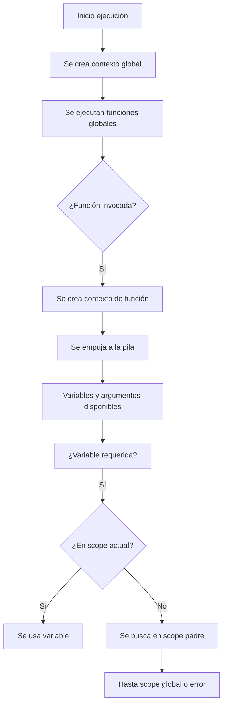

# Contexto de ejecución y scopes

El **contexto de ejecución** (*Execution Context*) es el entorno donde se evalúa y ejecuta el código JavaScript. Cada vez que se llama una función, se crea un nuevo contexto.

El motor de JavaScript utiliza una **pila de ejecución (call stack)** para manejar estos contextos, empujando (push) y extrayendo (pop) contextos conforme se llaman y retornan funciones.

## Tipos de contexto

|Tipo|Descripción|
|--|--|
|**Global**|Se crea al iniciar el programa, único y persistente|
|**De función**|Se crea cada vez que se llama una función|
|**Eval (evitar)**|Contexto generado por el uso de `eval()` (no recomendado)|

## Estructura del contexto de ejecución

Cada contexto contiene:

1. Objeto de variable (Variable Environment):
   - Declaraciones `var`, funciones, `let`, `const`
2. Scope Chain:
   - Acceso a variables en niveles superiores
3. Valor de `this`:
   - Determinado dinámicamente (en funciones normales) o léxicamente (en arrow functions)

## Ejemplo de pila de ejecución

```ts showLineNumbers
function greet(name: string) {
  return `Hola, ${name}`;
}

function welcome() {
  const message = greet('David');
  console.log(message);
}

welcome();
```

La pila de ejecución sería:

1. Global context
2. `welcome()` context
3. `greet()` context

## ¿Qué es el scope (ámbito)?

**Scope** es el conjunto de reglas que determina **dónde y cómo se puede acceder a las variables**.

### Tipos de scope

|Tipo de Scope|Descripción|
|--|--|
|**Global**|Fuera de cualquier función o bloque|
|**Función**|Dentro de una función|
|**Bloque**|Dentro de `{}` como en `if`, `for`, `while`, etc. (solo con `let` y `const`)|

Por ejemplo:

```ts showLineNumbers
const x = 10;                 // scope global

function test() {
  const y = 20;               // scope de función
  if (true) {
    const z = 30;             // scope de bloque
    console.log(x, y, z);     // 10, 20, 30
  }
  // console.log(z);          // ❌ Error: z no está definido
}
```

## Scope Chain (cadena de ámbitos)

Cuando se accede a una variable, JS busca en el orden:

1. En el scope actual
2. En el scope del padre
3. Hasta llegar al scope global

```ts showLineNumbers
const a = 'Global';

function outer() {
  const b = 'Outer';
  function inner() {
    const c = 'Inner';
    console.log(a, b, c); // Global, Outer, Inner
  }
  inner();
}
outer();
```

## Shadowing y Hoisting

### Shadowing

Una variable **en un scope más interno** puede **ocultar** una variable del mismo nombre en un scope externo.

```ts showLineNumbers
const name = 'David';

function sayHello() {
  const name = 'Ana';     // oculta a 'David'
  console.log(name);      // Ana
}
```

### Hoisting

- Las **declaraciones** con `var` y `function` se mueven arriba del scope.
- `let` y `const` son **hoisted**, pero en zona **temporalmente muerta (TDZ)** hasta su inicialización.

```ts
console.log(x);    // undefined
var x = 5;

console.log(y);    // ❌ Error
let y = 10;
```

## Contexto y Scope



## Principios recomendados

|Principio|Aplicación|
|--|--|
|Clean Code|Comprensión clara de alcance evita errores lógicos|
|SRP (S - SOLID)|Separar funciones con scopes definidos y pequeños|
|OCP|Facilita extender funciones sin alterar variables compartidas|
|Clean Architecture|Scope ayuda a mantener separación entre capas y responsabilidades|

## Referencias

- Flanagan, D. (2020). JavaScript: The Definitive Guide (7th ed.). O’Reilly Media.
- Mozilla Developer Network. (s.f.). [Scope and Closures](https://developer.mozilla.org/en-US/docs/Web/JavaScript/Closures).
- Crockford, D. (2008). JavaScript: The Good Parts. O’Reilly Media.
- Zakas, N. C. (2012). Maintainable JavaScript. O’Reilly Media.
- Google. (s.f.). [JavaScript Style Guide](https://google.github.io/styleguide/jsguide.html).
